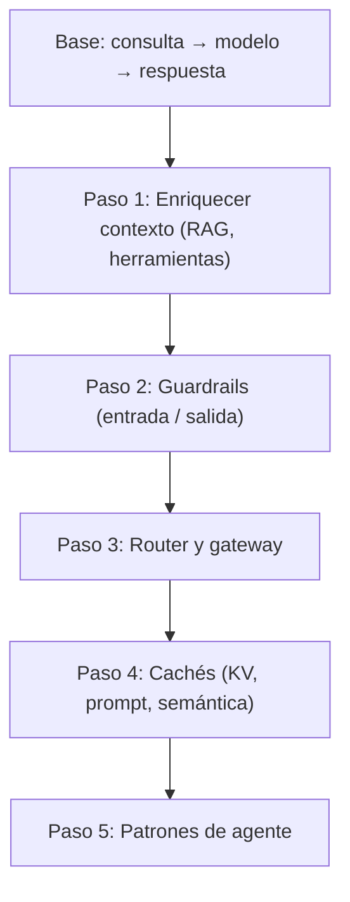

## Introducción

> **O'Reilly (1.ª ed.)** — Huyen (2025), **Capítulo 10**, aprox. **pp. 449–494**. Contrasta figuras y tablas con tu PDF.

Los capítulos anteriores cubrieron técnicas para **adaptar** modelos fundacionales. Este capítulo muestra cómo **ensamblarlos** en aplicaciones de producción—y cómo el **feedback de usuario** se convierte en fuente de datos de primer nivel para mejorar.

La sección de arquitectura sigue una **construcción gradual**: camino mínimo primero, componentes según necesidad. El feedback conversacional es más difícil de **extraer** que de solicitar—el diseño importa para UX y el volante de datos (capítulo 8).

## Objetivos de aprendizaje

Al terminar este capítulo deberías poder:

- Recorrer la **arquitectura progresiva en cinco pasos** con sus tradeoffs.
- Ubicar **guardrails** en entrada vs. salida según tu modelo de riesgo.
- Explicar responsabilidades de **router vs. gateway**.
- Diseñar captura de **feedback** que alimente el data flywheel con seguridad.
- Conectar observabilidad con **nuevos modos de fallo** de modelos fundacionales.

---

## Arquitectura de AI engineering

Patrón validado en muchas empresas—tu app puede diferir, pero los componentes se repiten.

### Línea base: consulta → modelo → respuesta

Consulta → API de modelo (tercero o self-hosted, capítulo 9) → respuesta. Sin contexto, guardrails ni optimización (figura 10-1 del libro).

### Paso 1. Enriquecer contexto

Añadir retrieval (texto, imagen, tabular) y **herramientas** (búsqueda, clima, APIs)—“feature engineering” para modelos fundacionales (capítulo 6).

Diferencias entre proveedores: límites de archivos, chunking, ejecución paralela de tools. Stacks RAG especializados vs APIs genéricas.

### Paso 2. Guardrails

Colocar guardrails donde hay riesgo—**entrada** y **salida**.

**Guardrails de entrada**

- **Ataques de prompt** (capítulo 5)—no se elimina todo el riesgo.
- **PII / secretos a APIs externas** — pegado por empleados, system prompts internos, tools con BD privada. Detectar; **bloquear** o **enmascarar** con mapa inverso para desenmascarar en respuestas. Ejemplo: filtración vía ChatGPT en Samsung.

**Guardrails de salida**

- Detectar fallos; política de manejo.
- **Calidad:** JSON inválido, alucinaciones, respuestas malas (capítulos 4–5).
- **Seguridad:** toxicidad, fuga PII, tools/código peligrosos, riesgo de marca. Medir también **tasa de rechazo falso**.
- **Reintentos:** modelos probabilísticos—reintentar salida vacía/mal formateada; **llamadas paralelas** eligen mejor respuesta más rápido.
- **Escalada humana:** palabras clave, sentimiento de enfado, bucles por turnos.

**Trade-offs:** guardrails añaden **latencia**; algunos equipos los omiten por velocidad. **Streaming** dificulta evaluar tokens parciales. APIs de terceros traen seguridad integrada; self-hosting reduce exposición externa pero más guardrails propios.

**Herramientas:** Purple Llama, NeMo Guardrails, Azure PyRIT / filtros de contenido, Perspective API, moderación OpenAI; gateways pueden incluir guardrails.

### Paso 3. Router y gateway de modelos

**Router** — enrutar por intención en lugar de un solo modelo:

- Modelos especializados (facturación vs soporte técnico).
- Modelos baratos para consultas simples.
- Rechazar fuera de alcance sin llamada API.
- Aclarar consultas ambiguas.
- **Siguiente acción** en agentes (intérprete vs búsqueda).
- **Memoria** (documento adjunto vs web).
- Límites de contexto tras retrieval—truncar o modelo con más contexto.

Clasificadores pequeños (BERT, Llama 7B)—**rápidos y baratos**. Patrón común: **routing → retrieval → generación → scoring**.

**Gateway** — interfaz unificada OpenAI, Gemini, self-hosted:

- Un solo camino de código cuando cambian APIs.
- **Control de acceso** y topes de coste.
- **Fallback** ante rate limits o caídas.
- Balanceo, logs, analítica, caché, guardrails.

Ejemplos: Portkey, MLflow AI Gateway, TrueFoundry, Kong, Cloudflare. El gateway **sustituye** la caja “API de modelo” en los diagramas.

### Paso 4. Reducir latencia con cachés

Además de **KV cache** y **prompt cache** (capítulo 9)—**caché de sistema**:

| Tipo | Regla | Riesgo |
|------|-------|--------|
| **Exacta** | Consulta/contexto idénticos | **Respuesta personalizada servida al usuario equivocado** |
| **Semántica** | Similitud de embeddings sobre umbral | Hit incorrecto; calidad embedding; coste búsqueda |

Caché exacta: resúmenes, resultados de búsqueda vectorial, cadenas multi-paso. Redis, PostgreSQL, LRU/LFU/FIFO. Clasificador para no cachear consultas personales o sensibles al tiempo.

Caché semántica: más hits, puede **dañar calidad**.

### Paso 5. Patrones de agente

Bucles (re-retrieval), ramas paralelas, **acciones de escritura** (email, pedidos, transferencias)—mucha capacidad, mucho riesgo (capítulo 6).

La complejidad exige **observabilidad**.

---

## Monitorización y observabilidad

La observabilidad debe **diseñarse desde el inicio**. Objetivo alineado con **evaluación** (capítulo 4): mitigar riesgo, encontrar oportunidades, rendición de cuentas.

**Salud estilo DevOps:**

- **MTTD** — tiempo medio hasta detectar.
- **MTTR** — tiempo medio hasta resolver.
- **CFR** — tasa de fallos en despliegues; CFR alto → eval pre-deploy débil.

Métricas de eval deben **traducirse** a producción; hallazgos de monitorización alimentan eval.

**Monitorización vs observabilidad:** la primera mira salidas externas; la segunda asume que el estado interno se infiere de logs/métricas/trazas.

### Métricas

Diseñar alrededor de **modos de fallo**—alucinación, coste, formato, seguridad.

- Formato: JSON inválido, auto-reparable vs estructural.
- Calidad: consistencia factual, concisión—**jueces IA**.
- Seguridad: toxicidad, PII, disparos de guardrails, rechazos, consultas anómalas.
- **Señales de usuario:** parar generación, turnos por conversación, tokens entrada/salida.
- **RAG:** relevancia de contexto; latencia del vector DB.
- Correlación con **north star** (DAU, duración de sesión).
- **Latencia:** TTFT, TPOT, total (capítulo 9).
- **Coste:** tokens, TPS, hit rate de caché.
- Spot check vs exhaustivo; desglose por usuario, release, versión de prompt, tiempo.

### Logs y trazas

**Métricas** agregan; **logs** registran eventos—“¿qué pasó hace cinco minutos?”

Registrar: config (modelo, temperature), consulta, prompt final, salida, tools, tiempos, IDs.

**Trazas** unen el timeline (estilo LangSmith): retrieval, prompts, latencia/coste por paso.

### Detección de deriva

- Cambios de **system prompt** (plantillas, typos corregidos).
- **Adaptación del usuario** (prompts más cortos con el tiempo).
- **Versiones de modelo silenciosas** tras la misma API—GPT-4 marzo vs junio 2023 (Chen et al.); ~10% caída GPT-3.5-0301 → 1106 (Voiceflow).

---

## Orquestación del pipeline de IA

**Orquestador** conecta modelos, retrieval, tools, eval, monitorización:

1. **Definición de componentes**
2. **Encadenamiento** — procesar → recuperar → prompt → generar → evaluar → usuario o humano

Distinto de Airflow general. **LangChain**, LlamaIndex, Flowise, Langflow, Haystack.

**Consejo:** empezar sin orquestador; añadir cuando la complejidad lo justifique. Cuidado con llamadas ocultas y latencia.

**Evaluar:** integración, ramas/paralelo/errores, documentación, escala.

**Latencia:** paralelizar routing y eliminación de PII.

---

## Feedback de usuario

El feedback impulsa **evaluación** y **desarrollo**; en IA es también **datos propietarios** para el volante. Despliegues open source dificultan la recogida.

Tratar feedback como **datos de usuario**—privacidad, consentimiento, transparencia.

### Explícito vs implícito

| Tipo | Ejemplos |
|------|----------|
| **Explícito** | Pulgar arriba/abajo, estrellas |
| **Implícito** | Compras, ediciones, regenerar, borrar chat |

Interfaces conversacionales permiten **feedback en lenguaje natural** (“No, quise decir…”, “Reserva el de las galerías”).

Usos: **métricas**, **desarrollo de modelo**, **personalización**.

### Extraer feedback conversacional

**Lenguaje natural:**

- **Terminación temprana**
- **Corrección de error** — “No…”, “Quise decir…”
- **Corrección de acción** — “Mira también su GitHub”
- **Confirmación** — “¿Seguro?” — falta detalle o desconfianza
- **Ediciones de usuario** — pares de preferencia (perdedora = modelo, ganadora = editada)
- **Quejas** — clusters FITS (Xu et al., 2022)
- **Sentimiento**; **tasa de rechazo** del modelo

**Acciones:**

- **Regeneración**
- **Organización** — borrar (malo), renombrar (bueno con título malo)
- **Longitud y diversidad** — bucle si repite líneas

### Diseño del feedback

**Cuándo:** onboarding opcional; en fallos; baja confianza (comparación lado a lado); positivo con muestreo (controversial).

**Cómo:** fluido, ignorable, con incentivos. **Midjourney** (4 imágenes → upscale/variations/regenerate). **Copilot** (Tab vs seguir escribiendo). Productos **integrados** (Gmail) superan ChatGPT standalone para feedback ligado a resultado.

Consentimiento para contexto con PII; explicar uso (personalización vs estadísticas vs entrenamiento).

Evitar comparaciones imposibles; UI clara (error emoji Luma 1 vs 5 estrellas).

**Público vs privado** cambia comportamiento (likes privados en X).

### Limitaciones del feedback

**Sesgos:** leniencia (Uber 4.8), clics aleatorios, **sesgo de posición**, preferencia por respuestas largas.

**Bucle degenerado:** amplificación de clics → burbujas de filtro; ejemplo de fotos de gatos; **adulación** al entrenar con feedback (Sharma et al., 2023).

Feedback solo sobre lo **mostrado**—sesgo de exposición.

---

## Cierre del capítulo

AI engineering es **ingeniería de sistemas**: arquitectura modular más **observabilidad** y **diseño de feedback** ligados a eval y datos.

Los componentes se solapan—guardrails en gateway, host o standalone. Cada capa añade capacidad y **complejidad**.

Los ingenieros asumen más el feedback porque alimenta el bucle de mejora—AI engineering se acerca al **producto** (capítulo 1).

Muchos retos requieren visión **del sistema completo**.

---

## Preguntas de discusión

- ¿Qué **paso de arquitectura** (contexto, guardrails, router, caché, agentes) falta hoy?
- ¿Dónde podría una **caché semántica** filtrar respuestas personalizadas a otro usuario?
- ¿Qué señal de **observabilidad** habría detectado tu último incidente?
- ¿Cómo evitas un **bucle de feedback degenerado**?
- ¿Qué feedback recoges sin dañar la UX?

---

## Relacionado

- **Anterior:** [Optimización de inferencia](/ai-engineering/docs/es/inference-optimization) — latencia y coste bajo carga.
- **Cierre:** [Introducción a aplicaciones de IA](/ai-engineering/docs/es/introduction-to-building-ai-applications-with-foundation-models) — stack y planificación del capítulo 1.
- **Datos de feedback:** [Ingeniería de datos](/ai-engineering/docs/es/dataset-engineering) — convertir logs en conjuntos de entrenamiento.
- **Epílogo:** [Epílogo](/ai-engineering/docs/es/epilogue) — perspectiva de cierre y repositorio del libro.
- **Repositorio del libro:** [chiphuyen/aie-book](https://github.com/chiphuyen/aie-book).
- **Glosario:** [Glosario](/ai-engineering/docs/es/glossary) — términos del libro y estas notas.

## Notas finales

Este capítulo es la capa de integración: esbozaría el **camino mínimo** primero y añadiría componentes solo con modos de fallo medidos—not every box del diagrama el día uno.

En producción, emparejaría **SLOs de goodput** (cap. 9) con **trazas** y señales implícitas conversacionales (parada temprana, reformulación, distancia de edición). Los bucles de feedback pasan revisión explícita de **sesgo y adulación** antes de entrenar.

Gateway + router temprano ahorra dolor al cambiar modelos o limitar gasto. **Caché semántica** como experimento con puertas de calidad, no por defecto.

**Referencia:** Huyen, C. (2025). *AI engineering: Building applications with foundation models*. O’Reilly Media. Capítulo 10: AI Engineering Architecture and User Feedback.

---

## Referencias

Huyen, C. (2025). *AI engineering: Building applications with foundation models*. O’Reilly Media. Capítulo 10: AI Engineering Architecture and User Feedback.

### Arquitectura, gateways y guardrails

- [NeMo Guardrails](https://github.com/NVIDIA/NeMo-Guardrails) — NVIDIA.
- [Purple Llama](https://ai.meta.com/purple-llama/) — Meta.
- [Portkey AI Gateway](https://github.com/Portkey-AI/gateway)
- [MLflow AI Gateway](https://mlflow.org/docs/latest/llms/gateway/index.html)
- [OpenAI Moderation API](https://platform.openai.com/docs/guides/moderation)
- [Perspective API](https://perspectiveapi.com/)

### Orquestación y observabilidad

- [LangChain](https://www.langchain.com/)
- [LlamaIndex](https://www.llamaindex.ai/)
- [LangSmith](https://www.langchain.com/langsmith)
- [OpenTelemetry](https://opentelemetry.io/)
- [Arize Phoenix](https://github.com/Arize-ai/phoenix)

### Caché y routing

- [GPTCache](https://github.com/zilliztech/GPTCache)

### Feedback y preferencias

- [FITS dataset](https://arxiv.org/abs/2204.10091) — Xu et al. (2022).
- [Learning from Natural Language Feedback](https://arxiv.org/abs/2306.08899) — Yuan et al. (2023).
- [InstructGPT / RLHF](https://arxiv.org/abs/2203.02155) — Ouyang et al. (2022).
- [Sycophancy in LLMs](https://arxiv.org/abs/2310.13581) — Sharma et al. (2023).

### Deriva de modelos

- [How Is ChatGPT’s Behavior Changing?](https://arxiv.org/abs/2307.09009) — Chen et al. (2023).

### Diseño de producto

- [Apple HIG — Ratings](https://developer.apple.com/design/human-interface-guidelines/ratings-and-reviews)
- [Midjourney docs](https://docs.midjourney.com/)
- [GitHub Copilot](https://docs.github.com/en/copilot)

### Monitorización general

- [Designing Machine Learning Systems](https://www.oreilly.com/library/view/designing-machine-learning/9781098107956/) — Huyen (2022).

### Cursos

- [Full Stack LLM Bootcamp](https://fullstackdeeplearning.com/llm-bootcamp/)
- [DeepLearning.AI — Building Systems with the ChatGPT API](https://www.deeplearning.ai/short-courses/building-systems-with-chatgpt/)
- [UPM — Taller 6 (PDF)](https://innovacioneducativa.upm.es/sites/default/files/saga/presentacion-taller6-programacion-software-ia.pdf)

### Repositorio del libro

- [AI Engineering — GitHub (Huyen)](https://github.com/chiphuyen/aie-book)
