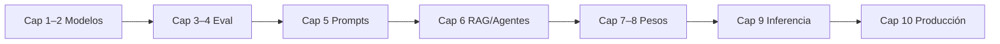

## Introducción

Usa esta página para planificar el recorrido por las [notas por capítulo](/ai-engineering/docs/es). Resume **qué cubre cada capítulo**, **qué herramientas aparecen** y **qué leer antes**.

---

## Mapa por capítulo

| Cap. | Capítulo | Temas centrales | Herramientas (en las notas) | Leer antes |
| --- | --- | --- | --- | --- |
| 1 | [Introducción](/ai-engineering/docs/es/introduction-to-building-ai-applications-with-foundation-models) | LM → foundation models, auto-supervisión, casos de uso, crawl–walk–run, stack tres capas | APIs de proveedores, planificación | — |
| 2 | [Entender foundation models](/ai-engineering/docs/es/understanding-foundation-models) | Arquitectura, Chinchilla, post-training (SFT, preferencias), muestreo, alucinación | Ecosistema HF (contexto), APIs OpenAI/Anthropic | 1 |
| 3 | [Metodología de evaluación](/ai-engineering/docs/es/evaluation-methodology) | PPL, corrección funcional, jueces IA, ranking Arena, contaminación | Patrones eval LangChain, Ragas/MLflow (refs), MT-Bench | 2 |
| 4 | [Evaluar sistemas modernos](/ai-engineering/docs/es/evaluating-modern-ai-systems) | Cuatro pilares, EDD, build vs buy, eval privado, enlace a producción | MMLU, HELM, LMSYS, HumanEval, APIs moderación | 3 |
| 5 | [Ingeniería de prompts](/ai-engineering/docs/es/prompt-engineering) | Instrucciones, CoT, prompting defensivo, OWASP LLM | Instructor, JSON mode, DSPy, NeMo/Purple Llama (refs) | 2, 3 |
| 6 | [RAG y agentes](/ai-engineering/docs/es/rag-and-agents) | Retrieve-then-generate, búsqueda híbrida, ReAct, tools, MCP/A2A | Elasticsearch/BM25, vector DBs, LangChain/LlamaIndex | 5 |
| 7 | [Finetuning](/ai-engineering/docs/es/finetuning) | PEFT/LoRA/QLoRA, memoria, RAG vs finetune | Hugging Face PEFT, DeepSpeed, bitsandbytes | 2, 5, 6 |
| 8 | [Ingeniería de datos](/ai-engineering/docs/es/dataset-engineering) | Calidad, mezcla Llama 3, sintéticos, volante de datos | Faker, Self-Instruct, pipelines de verificación | 4, 7 |
| 9 | [Optimización de inferencia](/ai-engineering/docs/es/inference-optimization) | Prefill/decode, KV cache, cuantización, serving | vLLM, TensorRT-LLM, llama.cpp, torch.compile | 2, 7 |
| 10 | [Arquitectura y feedback](/ai-engineering/docs/es/ai-engineering-architecture-and-user-feedback) | Arquitectura progresiva, guardrails, observabilidad, feedback | Gateways (Portkey, etc.), OpenTelemetry, LangSmith | 4, 6, 9 |
| — | [Glosario](/ai-engineering/docs/es/glossary) | Términos transversales | — | cualquiera |
| — | [Bibliografía](/ai-engineering/docs/es/bibliography) | Referencias agregadas | — | cualquiera |
| — | [Epílogo](/ai-engineering/docs/es/epilogue) | Cierre, repo del libro | [aie-book](https://github.com/chiphuyen/aie-book) | 10 |

---

## Rutas de lectura sugeridas

| Objetivo | Ruta |
| --- | --- |
| **Producto RAG** | 1 → 2 → 3 → 4 → 5 → 6 → 10 (ojear 9 para coste) |
| **Finetune tono/formato** | 1 → 2 → 3 → 5 → 7 → 8 → 9 |
| **Líder de evaluación** | 1 → 2 → 3 → 4 → 10 |
| **Plataforma / serving** | 2 → 9 → 10 (+ 4 para SLOs) |

---

## Relacionado

- [Overview](/ai-engineering/docs/es) — resúmenes breves
- [Bibliografía](/ai-engineering/docs/es/bibliography) — todas las `## References`
- [Glosario](/ai-engineering/docs/es/glossary) — términos filtrables

---

## References

Huyen, C. (2025). *AI engineering: Building applications with foundation models*. O’Reilly Media.

- [AI Engineering — GitHub (aie-book)](https://github.com/chiphuyen/aie-book)
