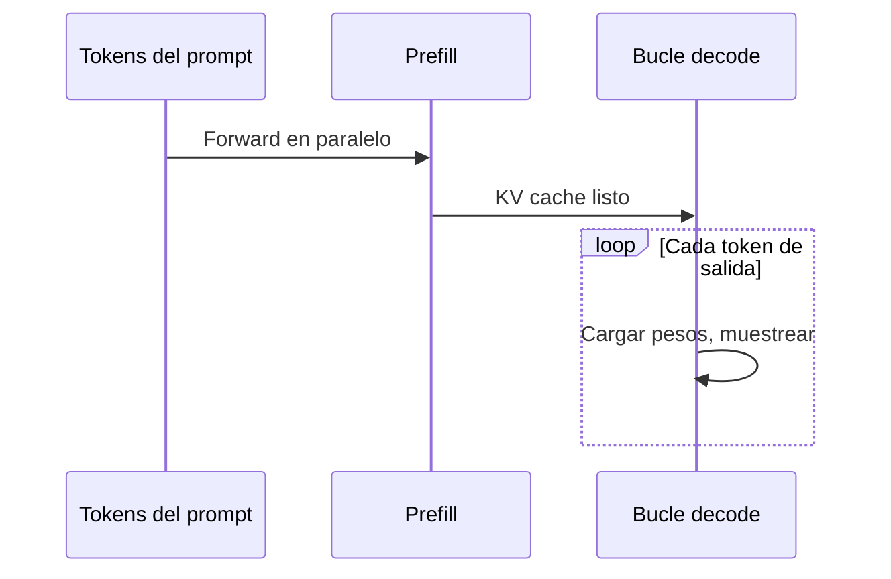

## Introducción

> **O'Reilly (1.ª ed.)** — Huyen (2025), **Capítulo 9**, aprox. **pp. 405–448**. Contrasta figuras y tablas con tu PDF.

Los mejores modelos importan—pero si la inferencia es **demasiado lenta** o **cara**, los usuarios se van y el ROI se desploma. Este capítulo trata de hacer modelos **más rápidos y baratos** a nivel de **modelo**, **hardware** y **servicio**.

La optimización es interdisciplinaria: investigadores de modelos, desarrolladores de aplicaciones, ingeniería de sistemas, compiladores, arquitectura de hardware y operadores de datacenters.

Aunque uses APIs alojadas (OpenAI, Google), entender estas técnicas ayuda a **evaluar proveedores**, diagnosticar latencia/coste y elegir modos online vs batch.

## Objetivos de aprendizaje

Al terminar este capítulo deberías poder:

- Clasificar cuellos de botella **compute-bound** vs. **bandwidth-bound**.
- Relacionar **TTFT, TPOT, throughput**, MFU/MBU con SLAs de producto.
- Explicar **prefill vs. decode** y por qué se desacoplan en producción.
- Elegir entre **cuantización, KV cache, batching, decodificación especulativa**.
- Negociar funciones del proveedor (**prompt cache**, enrutado) con datos de eval.

---

## Entender la optimización de inferencia

| Fase | Qué ocurre |
|------|------------|
| **Entrenamiento** | Construir el modelo (forward + backward) |
| **Inferencia** | Solo forward—lo que más ejecutan equipos de aplicación |

El **servidor de inferencia** aloja modelos en hardware; el **servicio de inferencia** enruta, preprocesa y devuelve respuestas.

### Cuellos de botella computacionales (Roofline)

De **Roofline** (Williams et al., 2009)—clasificar cargas por **intensidad aritmética** (ops por byte movido):

| Tipo | Limitado por | Ejemplo |
|------|--------------|---------|
| **Compute-bound** | FLOP/s | Prefill de LLM |
| **Memory bandwidth-bound** | GB/s HBM↔compute | **Decode** de LLM (cargar pesos completos por token) |

**Nota terminológica:** “Memory-bound” a veces significa **capacidad OOM** (partir modelo CPU/GPU); a menudo se reduce a ancho de banda al mover shards.

**Inferencia LLM (transformer autoregresivo):**

1. **Prefill** — procesa tokens de entrada en paralelo; llena **KV cache** inicial; suele ser **compute-bound**.
2. **Decode** — un token de salida por paso; recarga matrices de pesos; suele ser **memory bandwidth-bound**.

Contexto largo, longitud de salida y batching cambian el cuello de botella. **Desacoplar prefill y decode** en máquinas distintas es habitual (DistServe, Zhong et al., 2024).

| Fase | Qué ocurre | Cuello de botella típico (libro) |
| --- | --- | --- |
| **Prefill** | Procesar todos los tokens del prompt en paralelo; llenar KV cache | **Compute-bound** |
| **Decode** | Generar un token cada vez; recargar pesos en cada paso | **Memory bandwidth-bound** |

**Stable Diffusion** suele ser compute-bound; **LLMs autoregresivos** bandwidth-bound hoy—el hardware/software puede cambiar esto.

### APIs online vs. batch

| Tipo | Optimiza | Uso típico |
|------|----------|------------|
| **Online** | Baja latencia | Chatbots, código |
| **Batch** | Coste (~50% descuento OpenAI/Gemini al escribir) | Datos sintéticos, informes, reindexado |

Las APIs online pueden micro-batchear si la latencia lo permite.

**Streaming** devuelve tokens al generarlos—mejor latencia percibida, pero no puedes puntuar la respuesta completa antes de mostrarla.

**Nota:** el “batch API” de modelos fundacionales ≠ batch ML clásico (precomputar recomendaciones). Los prompts abiertos no se precomputan; **prompt caching** ayuda con system prompts repetidos (capítulo 5).

---

## Métricas de rendimiento

### Latencia, TTFT, TPOT

- **Latencia** — consulta hasta respuesta completa.
- **TTFT (time to first token)** — dominado por **prefill**; el chat debe sentirse instantáneo.
- **TPOT (time per output token)** — tras el primer token; ~**120 ms/token** (~6–8 tok/s) ≈ lectura humana rápida.
- **TBT / ITL** — tiempo entre tokens.

`latencia_total ≈ TTFT + TPOT × num_tokens_salida`

La misma latencia total puede sentirse distinta según el reparto TTFT/TPOT—mueve capacidad entre flotas prefill y decode.

**Agentes / CoT:** el “primer token” del modelo puede ser planificación interna; el usuario ve TTFT en la respuesta final—usa **time to publish** si ocultas pasos intermedios.

Informa **percentiles** (p50, p90, p95, p99). Grafica TTFT vs longitud de entrada.

**Regla práctica (Anyscale):** ~**100 tokens de entrada** ≈ impacto de latencia de **un token de salida** (Kadous et al., 2023).

### Throughput y goodput

- **Throughput** — **tokens/s** de salida agregados (cuenta prefill y decode por separado si están desacoplados).
- **RPM / RPS** — peticiones completadas por minuto/segundo.
- **Vínculo con coste:** 2 USD/h a 100 tok/s ≈ **5,56 USD por 1M tokens de salida** (ejemplo del libro).

**Goodput** — peticiones/s que cumplen **SLOs** (p. ej. TTFT ≤ 200 ms y TPOT ≤ 100 ms). 100 RPM con solo 30 dentro del SLO → goodput = 30 RPM.

### Utilización: MFU y MBU

La “utilización GPU” de **nvidia-smi** = % tiempo ocupado—no eficiencia de FLOPs.

- **MFU (Model FLOP/s Utilization)** — tok/s observados vs pico teórico (PaLM, Chowdhery et al., 2022).
- **MBU (Model Bandwidth Utilization)** — ancho de banda usado vs pico.

Ancho de banda usado (aprox.): `num_parámetros × bytes_por_param × tokens_por_segundo`

`MBU = ancho_banda_usado / pico_teórico`

Ejemplo — 7B FP16 a 100 tok/s en A100 2 TB/s: 7B × 2 × 100 = 700 GB/s → **70% MBU**. La cuantización (cap. 7) reduce demanda de banda.

La meta no es maximizar utilización—es **más rápido y más barato**.

| Métrica | Qué mide | Cuándo mirarla |
| --- | --- | --- |
| **TTFT** | Tiempo al primer token | UX de chat, streaming |
| **TPOT / TBT** | Tiempo por token de salida | Respuestas largas |
| **Throughput** | Tokens/s o RPM | Capacidad |
| **Goodput** | Peticiones que cumplen SLO | SLAs de producción |
| **MFU** | FLOP/s vs pico | Cargas con mucho prefill |
| **MBU** | Banda HBM vs pico | Serving decode-heavy |

---

## Aceleradores de IA (panorama)

**GPUs** dominan (matmul ~90%+ de FLOPs). CPUs: pocos núcleos potentes; GPUs: miles de núcleos para paralelismo.

**La inferencia puede superar el coste de entrenamiento** en producción—hasta **90%** del gasto ML (Desislavov et al., 2023). Chips de inferencia priorizan **baja precisión** y **acceso rápido a memoria** (Inferentia, MTIA, Apple Neural Engine).

**Especificaciones clave:** FLOP/s (por precisión), **tamaño y banda HBM**, potencia (H100 ~7.000 kWh/año a pico). Jerarquía: DRAM CPU → HBM GPU → SRAM on-chip.

**Programación:** PyTorch/TensorFlow con control limitado; **CUDA**, **Triton**, **ROCm** para kernels.

**Elegir chips:** ¿Ejecuta la carga? ¿Qué tan rápido? ¿Cuánto cuesta? Compute-bound → más FLOP/s; bandwidth-bound → más HBM.

---

## Optimización a nivel de modelo

Tres dolores del LLM: **tamaño**, **decodificación autoregresiva**, **atención**.

### Compresión

- **Cuantización** (cap. 7) — dominante; PTQ weight-only muy popular.
- **Destilación** (cap. 8) — estudiante pequeño imita maestro.
- **Pruning** — menos común en producción que cuant (Frankle & Carbin, 2019).

### Acelerar decodificación autoregresiva

**Speculative decoding:** modelo **draft** propone K tokens; modelo **target** verifica en paralelo; acepta el prefijo más largo acordado + un token de corrección. Chinchilla-70B + draft 4B: **>2×** (Chen et al., 2023). En **vLLM**, TensorRT-LLM, llama.cpp.

**Inference with reference:** copia tramos repetidos de la entrada (RAG, código)—hasta **2×** (Yang et al., 2023).

**Decodificación paralela:** varios tokens futuros (Lookahead, **Medusa**)—verificación Jacobi o árbol; hasta **1.9×** en H200 (NVIDIA).

### Atención y KV cache

Cada paso de decode necesita K/V de tokens previos → **KV cache** (solo inferencia).

- Cómputo de atención: O(n²) en longitud.
- Tamaño KV crece **lineal** con longitud y batch—puede **superar pesos** (ejemplo 500B: ~3 TB KV vs 1 TB pesos, Pope et al., 2022).

**Memoria KV (sin optimizar):** `2 × B × S × L × H × M`

Ejemplo Llama 2 13B en libro: **~54 GB** KV con B=32, S=2048.

**Cambios de arquitectura (entrenamiento/finetune):** atención local, multi-query / grouped-query, KV compartido entre capas (Character.AI: **20×** menos KV).

**Runtime:** **PagedAttention** (vLLM), cuantización KV, compresión selectiva.

**FlashAttention** (Dao et al., 2022) — kernels fusionados; FlashAttention-3 para H100.

### Kernels y compiladores

Vectorización, paralelización, tiling, fusión de operadores. **Lowering** con **torch.compile**, XLA, **TensorRT**, TVM, MLIR.

**Checklist de optimización PyTorch Llama-7B (A100, libro):**

1. **`torch.compile`** — fusión de grafo base.
2. **Cuantización INT8** — menos ancho de banda.
3. **INT4** — más compresión (vigilar calidad).
4. **Decodificación especulativa** — draft + verificación.

Medir **calidad en tu eval** tras cada paso, no solo tokens/s.

### Stacks de serving (comparativa breve)

| Stack | Fortaleza | Uso típico |
| --- | --- | --- |
| **vLLM** | PagedAttention, alto throughput | Serving multi-tenant en GPU |
| **TensorRT-LLM** | Kernels optimizados NVIDIA | Latencia en flotas NVIDIA |
| **llama.cpp** | CPU/Apple Silicon, quant | Edge, local, modelos pequeños |

---

## Optimización del servicio de inferencia

No cambia salidas del modelo—asignación de recursos bajo carga dinámica.

### Batching

| Técnica | Comportamiento |
|---------|----------------|
| **Estático** | Tamaño fijo; la primera petición espera llenar batch |
| **Dinámico** | Tamaño máximo O ventana temporal |
| **Continuo (Orca)** | Devuelve secuencias terminadas; rellena batch |

Mejora throughput; puede dañar latencia.

### Desacoplar prefill y decode

Pools GPU separados. **DistServe**, **Inference Without Interference** (Hu et al., 2024). Ratio prefill:decode ~2:1–4:1 (entradas largas / bajo TTFT); ~1:2–1:1.25 (entradas cortas / bajo TPOT).

### Prompt caching

Cachea prefijos repetidos (system prompt, documento largo, historial). Ahorra tokens masivos; coste de almacenamiento. Gemini ~75% descuento en tokens cacheados; Anthropic hasta **90%** coste / **75%** latencia en contextos largos (tabla 9-3 del libro).

### Paralelismo

- **Réplicas** — más concurrencia.
- **Paralelismo tensorial** — operadores repartidos; modelos enormes; overhead de comunicación.
- **Pipeline** — etapas en dispositivos; más latencia por petición; común en **entrenamiento**.
- **Paralelismo de contexto/secuencia** — entradas largas repartidas.

**Bin-packing:** mezclar tamaños de modelo en GPUs de distinta memoria.

---

## Cierre del capítulo

Mide **TTFT, TPOT, throughput, goodput, MFU/MBU** antes de optimizar. **Cuantización**, **paralelismo tensorial + réplicas** y **atención/KV** suelen dar las mayores ganancias; **speculative decoding** y **prompt caching** dependen del workload.

Cambios a nivel modelo pueden alterar calidad (distintos proveedores sirven el mismo Llama con optimizaciones distintas). Técnicas de servicio preservan salidas.

El capítulo 10 integra las técnicas de adaptación en un sistema completo.

---

## Preguntas de discusión

- ¿Tu carga es más **prefill** o **decode**? ¿Qué implica para el hardware?
- ¿Qué métrica importa más al usuario: **TTFT** o **TPOT**?
- ¿Ayudaría la **decodificación especulativa** si el MFU ya es alto?
- ¿Cuándo es seguro el **prompt caching** frente a un fallo de privacidad?
- ¿Cuál es tu objetivo de **goodput** por dólar?

---

## Relacionado

- **Anterior:** [Ingeniería de datos](/ai-engineering/docs/es/dataset-engineering) — modelos que vas a servir.
- **Siguiente:** [Arquitectura de IA y feedback de usuario](/ai-engineering/docs/es/ai-engineering-architecture-and-user-feedback) — cachés, gateways y UX en producción.
- **Modelos:** [Entender modelos fundacionales](/ai-engineering/docs/es/understanding-foundation-models) — bases de la decodificación autoregresiva.
- **Finetuning:** [Finetuning](/ai-engineering/docs/es/finetuning) — huella de memoria de pesos adaptados.
- **Repositorio del libro:** [chiphuyen/aie-book](https://github.com/chiphuyen/aie-book).
- **Glosario:** [Glosario](/ai-engineering/docs/es/glossary) — términos del libro y estas notas.

## Notas finales

Para equipos de producto en APIs, este capítulo es una lente **comprar vs construir**: si el p99 de TTFT sube, pregunta si el proveedor desacopla prefill/decode, ofrece prompt caching o limita batching. En self-hosting, perfilaría con mentalidad **roofline** antes de comprar GPUs más grandes—chat decode-heavy puede necesitar banda, no FLOPs.

Separo **goodput** de throughput bruto en revisiones de SLO: duplicar tok/s violando TPOT es mal negocio en chat. **Speculative decoding** y **prompt caching** son palancas altas cuando el workload encaja (código/RAG; system prompts repetidos).

Potencia y **MBU** conectan coste de inferencia con sostenibilidad y cuantización del capítulo 7. El stack PyTorch (compile + quant + speculative) es checklist práctica para un primer sprint de optimización.

**Referencia:** Huyen, C. (2025). *AI engineering: Building applications with foundation models*. O’Reilly Media. Capítulo 9: Inference Optimization.

---

## Referencias

Huyen, C. (2025). *AI engineering: Building applications with foundation models*. O’Reilly Media. Capítulo 9: Inference Optimization.

### Roofline, métricas y perfilado

- [Roofline](https://people.eecs.berkeley.edu/~kubitron/cs252/handouts/papers/RooflineVyNoYellow.pdf) — Williams et al. (2009).
- [NVIDIA Nsight](https://developer.nvidia.com/nsight-systems)
- [Anyscale — LLM inference performance](https://www.anyscale.com/blog/llm-inference-performance) — Kadous et al. (2023).
- [LinkedIn — reflexiones despliegue GenAI](https://www.linkedin.com/blog/engineering/generative-ai) — (2024).

### Prefill/decode y sistemas de serving

- [DistServe](https://arxiv.org/abs/2401.09670) — Zhong et al. (2024).
- [Orca: Continuous Batching](https://www.usenix.org/conference/osdi22/presentation/yu) — Yu et al. (2022).
- [vLLM / PagedAttention](https://arxiv.org/abs/2309.06180) — Kwon et al. (2023).
- [vLLM](https://github.com/vllm-project/vllm)
- [TensorRT-LLM](https://github.com/NVIDIA/TensorRT-LLM)
- [llama.cpp](https://github.com/ggerganov/llama.cpp)

### Aceleración de decodificación

- [Speculative Decoding](https://arxiv.org/abs/2211.10438) — Leviathan et al. (2022); Chen et al. (2023).
- [Inference with Reference](https://arxiv.org/abs/2304.04487) — Yang et al. (2023).
- [Medusa](https://arxiv.org/abs/2401.10774) — Cai et al. (2024).
- [Lookahead Decoding](https://arxiv.org/abs/2402.02057) — Fu et al. (2024).

### Atención y KV cache

- [FlashAttention](https://arxiv.org/abs/2205.14135) — Dao et al. (2022).
- [FlashAttention-3](https://arxiv.org/abs/2407.08608) — Shah et al. (2024).
- [Efficiently Scaling Transformer Inference](https://arxiv.org/abs/2211.05102) — Pope et al. (2022).
- [GQA](https://arxiv.org/abs/2305.13245) — Ainslie et al. (2023).

### Hardware y utilización

- [PaLM](https://arxiv.org/abs/2204.02311) — Chowdhery et al. (2022) — MFU.
- [ML Accelerator Survey](https://arxiv.org/abs/2303.04608) — Desislavov et al. (2023).
- [PyTorch — torch.compile Llama](https://pytorch.org/blog/accelerating-generative-ai/) — (2023).
- [OpenAI Triton](https://github.com/triton-lang/triton)

### APIs, caching y batch

- [OpenAI — Batch API](https://platform.openai.com/docs/guides/batch)
- [Google Gemini — Context caching](https://ai.google.dev/gemini-api/docs/caching)
- [Anthropic — Prompt caching](https://docs.anthropic.com/en/docs/build-with-claude/prompt-caching)
- [OpenAI — Prompt caching](https://platform.openai.com/docs/guides/prompt-caching)

### Compiladores

- [Apache TVM](https://tvm.apache.org/)
- [MLIR](https://mlir.llvm.org/)
- [torch.compile](https://pytorch.org/docs/stable/torch.compiler.html)
- [NVIDIA TensorRT](https://developer.nvidia.com/tensorrt)

### Cursos y talleres

- [Full Stack LLM Bootcamp — serving (YouTube)](https://www.youtube.com/results?search_query=full+stack+llm+bootcamp+serving)
- [Meta — Llama inference (engineering blog)](https://engineering.fb.com/)
- [UPM — Taller 6: Programación de software con IA (PDF)](https://innovacioneducativa.upm.es/sites/default/files/saga/presentacion-taller6-programacion-software-ia.pdf)

### Repositorio del libro

- [AI Engineering — GitHub (Huyen)](https://github.com/chiphuyen/aie-book)
