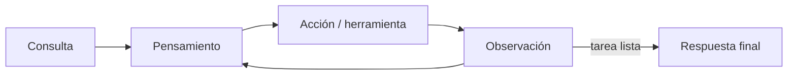

## Introducción

> **O'Reilly (1.ª ed.)** — Huyen (2025), **Capítulo 6**, aprox. **pp. 253–306**. Contrasta figuras y tablas con tu PDF.

Un modelo necesita **instrucciones** (capítulo 5) y **contexto** por consulta. El capítulo 5 cubrió cómo escribir instrucciones; este capítulo cubre **cómo construir contexto**—los dos patrones dominantes son **RAG** (*retrieval-augmented generation*) y **agentes** (planificadores con herramientas).

- **RAG** recupera de memoria externa (bases de datos, chats previos, web) e inyecta resultados en el generador.
- **Agentes** usan herramientas (búsqueda, SQL, ejecución de código, APIs) para percibir y actuar en un entorno.

RAG es sobre todo **construcción de contexto**; los agentes pueden hacer eso y más—incluidas **acciones de escritura** que cambian el mundo. Ambos extienden modelos base potentes; ambos exigen **evaluación** y **seguridad** rigurosas (capítulo 5).

---

## Generación aumentada por recuperación (RAG)

> RAG es una técnica que mejora la salida de un foundation model recuperando primero información relevante de una fuente externa y proporcionando esa información como contexto para la generación.
>
> — Huyen (2025, p. 253)

**Recuperar y luego generar** aparece en Chen et al. (2017, QA sobre Wikipedia). Lewis et al. (2020) acuñaron **RAG** para tareas intensivas en conocimiento: solo entran los fragmentos más relevantes, mejorando el detalle y reduciendo alucinaciones cuando falta contexto.

**Por qué RAG sigue importando con contexto largo**

1. Los datos de la aplicación suelen crecer **más rápido** que los límites de contexto (“el contexto se expande hasta llenar el límite”).
2. Contexto largo ≠ buen uso del contexto (**lost in the middle**, coste por token, latencia).
3. RAG selecciona contexto **específico por consulta**—útil para datos por usuario y control de coste.

Anthropic (2024) sugiere que para Claude, si la base de conocimiento tiene menos de ~200k tokens (~500 páginas), podrías omitir RAG y meter todo en el prompt—la guía varía por modelo.

Construir contexto para foundation models equivale a **feature engineering** en ML clásico: mismo propósito, mecanismo distinto.

### Arquitectura RAG

Dos componentes:

1. **Recuperador** — **indexación** (preparar datos) y **consulta** (obtener fragmentos relevantes).
2. **Generador** — LLM que responde con el prompt del usuario + fragmentos recuperados.

Lewis et al. entrenaban recuperador y generador juntos; hoy muchos sistemas usan piezas **off-the-shelf**, aunque el finetuning end-to-end puede ayudar. **La calidad del recuperador domina** el sistema.

Flujo típico: **fragmentar** documentos → recuperar top-*k* → unir al prompt final → generar. Recuperar documentos enteros puede reventar la ventana de contexto.

### Algoritmos de recuperación

La recuperación ordena documentos por **relevancia**. Dos familias:

#### Recuperación por términos (dispersa)

Coincidencia por palabras clave: **TF** (frecuencia del término), **IDF** (frecuencia inversa—términos raros pesan más). **TF-IDF** combina ambos.

Herramientas: **Elasticsearch** (índice invertido), **BM25** (variante normalizada por longitud; baseline fuerte). Pros: **rápido**, barato, buen rendimiento inicial. Contras: **sin semántica**—“transformer” mezcla dispositivos eléctricos y películas.

La tokenización importa: n-gramas (“hot dog”), minúsculas, stop words.

#### Recuperación por embeddings (densa)

**Recuperación semántica:** embeber consulta y fragmentos; ordenar por similitud vectorial. Requiere buen **modelo de embeddings** y **base vectorial** con búsqueda ANN.

**Búsqueda vectorial:** kNN exacto en datos pequeños; **ANN** (FAISS, HNSW, ScaNN, Annoy) a escala.

| Dimensión | Por términos | Por embeddings |
|-----------|--------------|----------------|
| Velocidad | Indexación y consulta más rápidas | Coste de embedding + ANN |
| Semántica | Débil | Fuerte (si el embedder es bueno) |
| Techo de mejora | Más bajo | Finetuning de embedder/recuperador |
| Consultas con códigos exactos | Fuerte | Puede fallar |
| Coste | Menor | Mayor |

**Evaluación:** **precisión de contexto**, **recall de contexto**, NDCG/MAP/MRR; **MTEB** para embeddings; evaluación **end-to-end** de respuestas (caps. 3–4).

#### Búsqueda híbrida

- **Secuencial:** BM25 → **rerank** semántico.
- **Paralelo + fusión:** p. ej. **RRF** (Cormack et al., 2009).

### Optimización de la recuperación

**Fragmentación (*chunking*)** — tamaño fijo o recursivo; **solapamiento** en límites; experimentar tamaño y solapamiento.

**Reranking** — refinar ranking inicial; peso temporal en noticias/correo.

**Reescritura de consultas** — desambiguar seguimientos conversacionales con un LLM.

**Recuperación contextual** — metadatos, preguntas que responde el fragmento, contexto situatorio estilo Anthropic antes de indexar.

### Más allá del texto

**RAG multimodal** — texto + imágenes (CLIP en base vectorial).

**RAG tabular** — **text-to-SQL** → ejecutar → generar (ejemplo Kitty Vogue del libro).

### Elegir solución de recuperación

Híbrido, algoritmos ANN, escala, latencia de indexación/consulta, precios, ACL/compliance.

---

## Agentes de IA

> Un agente es cualquier entidad que puede percibir su entorno y actuar sobre él.
>
> — Russell & Norvig (1995), citado en Huyen (2025, p. 275)

Los foundation models permiten agentes que **planifican** y usan **herramientas**. El campo aún no tiene una teoría única—este capítulo es un marco práctico.

**Definición:** entorno + **acciones** (vía herramientas). ChatGPT y los **sistemas RAG** (recuperador, SQL como herramientas) son agentes.

**Planificador (FM):** tarea + feedback → plan → ejecutar → comprobar fin. **Error compuesto:** 95% por paso → ~60% en 10 pasos. **Mayor impacto** con herramientas de escritura.

### Herramientas

**Lectura:** recuperadores, web, SQL SELECT.  
**Escritura:** UPDATE/DELETE, enviar correo—requieren confianza, aprobación, sandbox (cap. 5).

Categorías: **aumento de conocimiento**, **extensión de capacidad** (calculadora, intérprete de código), **escritura** en sistemas reales.

**Function calling:** declarar herramientas; subconjunto por consulta; validar parámetros en logs.

**Selección de herramientas:** más herramientas = más capacidad y más confusión; estudios de ablación; definiciones de herramienta muy claras; diseño **poka-yoke**.

### Planificación y ejecución

**Desacoplar planificación y ejecución:** generar plan → validar → ejecutar.

**Humano en el bucle** en plan, validación o ejecución—sobre todo operaciones arriesgadas.

Bucle: planificar → reflexionar → ejecutar → reflexionar de nuevo.

**Clasificación de intent** para enrutar herramientas; marcar consultas **IRRELEVANT**.

**¿Pueden planificar los LLM?** Debate (LeCun, Kambhampati); modelos de mundo (Hao et al., 2023).

**Flujos de control:** secuencial, **paralelo**, **if/else**, **bucles**.

**ReAct** (Yao et al., 2022): **Pensamiento → Acto → Observación**.

**Reflexion** (Shinn et al., 2023): evaluador + autocrítica.

### Patrones avanzados de agentes (Anthropic, 2024)

| Patrón | Idea |
|--------|------|
| **Encadenamiento de prompts** | Secuencia lineal de llamadas LLM. |
| **Enrutamiento** | Clasificar intent → prompt/herramientas especializadas. |
| **Evaluador–optimizador** | Generador + crítico en bucle. |
| **Orquestador–trabajadores** | LLM central delega subtareas. |

**Buenas prácticas:** especificaciones de herramienta claras; APIs a prueba de errores del LLM; **empezar simple**.

### Evaluación de agentes

Fallos de **planificación** (herramienta inválida, parámetros malos, meta no cumplida, falsa finalización).

Fallos de **herramienta** (salida incorrecta, traducción NL→comando, herramientas faltantes).

**Eficiencia** — pasos, coste, latencia.

### Memoria

| Tipo | Qué | Persistencia |
|------|-----|--------------|
| **Conocimiento interno** | Pesos del entrenamiento | Hasta actualizar modelo |
| **Corto plazo** | Ventana de contexto | Por sesión |
| **Largo plazo** | Vector DB, archivos | Entre sesiones |

Gestión: FIFO simple vs **resumen** y **reflexión** sobre qué fusionar o borrar. Recuperar de largo plazo **es RAG**.

### Complemento: protocolos de agentes de IA

*No es núcleo del cap. 6 de Huyen (2025); material del curso (Yang et al., 2025).*

Los **protocolos de agentes** estandarizan formatos y procedimientos para interoperabilidad.

**Taxonomía (Yang et al., 2025):**

- **Orientación al contexto** (agente ↔ recursos, p. ej. **MCP**) vs **inter-agente** (p. ej. **A2A**).
- **Escenario:** propósito general vs dominio específico.

**Trilema de comunicación:** versatilidad, eficiencia, portabilidad—difícil maximizar las tres.

---

## Cierre del capítulo

El capítulo 6 empareja **RAG** (recuperar → generar; disperso vs denso vs híbrido; chunking, reescritura, recuperación contextual; multimodal y SQL) con **agentes** (entorno, herramientas, planificación desacoplada, ReAct/Reflexion, evaluación, memoria). RAG es un caso especial de agente cuya herramienta principal es la recuperación. Ambos son adaptaciones **basadas en prompt**; el finetuning es el capítulo 7.

Los agentes requieren **ingeniería defensiva** del capítulo 5 cuando las herramientas tocan datos, código e internet—sobre todo **inyección indirecta** vía contenido recuperado o navegado.

---

## Preguntas de discusión

- ¿Dónde gana la **recuperación híbrida** frente a solo denso en tu dominio?
- ¿Cuál es el modo de fallo de tu estrategia de **chunking** hoy?
- Esboza un bucle **ReAct** para un flujo—¿qué valida un humano?
- ¿Qué **fallos de agente** (planificación vs. herramientas) dominan tus logs?
- ¿Cuándo basta RAG sin agente?

---

## Relacionado

- **Anterior:** [Ingeniería de prompts](/ai-engineering/docs/es/prompt-engineering) — diseño de instrucciones y contexto.
- **Siguiente:** [Finetuning](/ai-engineering/docs/es/finetuning) — cuando recuperación y herramientas no bastan.
- **Datos:** [Ingeniería de datos](/ai-engineering/docs/es/dataset-engineering) — corpus y calidad de chunks para recuperación.
- **Evaluación:** [Evaluar sistemas de IA modernos](/ai-engineering/docs/es/evaluating-modern-ai-systems) — evaluación end-to-end y por componente.
- **Repositorio del libro:** [chiphuyen/aie-book](https://github.com/chiphuyen/aie-book).
- **Glosario:** [Glosario](/ai-engineering/docs/es/glossary) — términos del libro y estas notas.

## Notas finales

Lo que me queda es que **construir contexto es ingeniería de producto**: RAG no se “resuelve” con una ventana de 2M tokens—sigue habiendo chunking, búsqueda híbrida, reescritura de consultas y medición de precisión/recall en *tu* corpus. Empezaría con **BM25/Elasticsearch** como baseline antes del coste de embeddings.

En **agentes**, el error compuesto obliga a **validar planes**, **puertas humanas en escrituras** y **reflexión** sin disparar tokens. Los patrones de Anthropic (enrutar → trabajador, bucle evaluador) dan una escalera razonable desde un solo encadenamiento de prompts. Trataré las **definiciones de herramientas** como diseño de API de primer nivel.

Los protocolos (MCP, A2A) importan al integrar agentes entre equipos; el trilema recuerda que en v1 no puedo maximizar versatilidad, eficiencia y portabilidad a la vez.

**Referencia:** Huyen, C. (2025). *AI engineering: Building applications with foundation models*. O’Reilly Media. Capítulo 6: RAG and Agents.

---

## Referencias

Huyen, C. (2025). *AI engineering: Building applications with foundation models*. O’Reilly Media. Capítulo 6: RAG and Agents.

Lewis, P., et al. (2020). Retrieval-augmented generation for knowledge-intensive NLP tasks. https://arxiv.org/abs/2005.11401

Yang, Y., et al. (2025). A survey of AI agent protocols. https://arxiv.org/abs/2504.16736

Anthropic. (2024). Building effective agents. https://www.anthropic.com/engineering/building-effective-agents

Anthropic. (2024). Introducing contextual retrieval. https://www.anthropic.com/news/contextual-retrieval

### Artículos fundacionales (RAG y recuperación)

- [RAG (Lewis et al., 2020)](https://arxiv.org/abs/2005.11401)
- [Reading Wikipedia to Answer Questions (Chen et al., 2017)](https://arxiv.org/abs/1704.00051)
- [BM25 and Beyond (Robertson & Zaragoza, 2009)](https://www.nowpublishers.com/article/Details/INR-019)
- [Reciprocal Rank Fusion](https://plg.uwaterloo.ca/~gvcormac/cormacnorris09a.pdf)
- [Lost in the Middle (Liu et al., 2023)](https://arxiv.org/abs/2307.03172)

### Agentes, planificación y herramientas

- [ReAct (Yao et al., 2022)](https://arxiv.org/abs/2210.03629)
- [Reflexion (Shinn et al., 2023)](https://arxiv.org/abs/2303.11366)
- [Chameleon (Lu et al., 2023)](https://arxiv.org/abs/2304.09842)
- [Planning with World Model (Hao et al., 2023)](https://arxiv.org/abs/2305.14992)
- [Can LLMs Really Reason and Plan? (Kambhampati, 2023)](https://yochan-lab.github.io/papers/llm_reasoning_planning.pdf)

### Guías oficiales y tutoriales

- [Anthropic — Building effective agents](https://www.anthropic.com/engineering/building-effective-agents)
- [Anthropic — Contextual retrieval](https://www.anthropic.com/news/contextual-retrieval)
- [OpenAI — Function calling](https://platform.openai.com/docs/guides/function-calling)
- [LangChain — Conceptos RAG](https://python.langchain.com/docs/concepts/rag/)
- [LlamaIndex — Construir RAG](https://docs.llamaindex.ai/en/stable/optimizing/building_rag/)

### Búsqueda vectorial y bases de datos

- [FAISS](https://github.com/facebookresearch/faiss)
- [ANN-Benchmarks](https://ann-benchmarks.com/)
- [MTEB Leaderboard](https://huggingface.co/spaces/mteb/leaderboard)
- [BEIR](https://github.com/beir-cellar/beir)
- [Zilliz — Vector search](https://zilliz.com/learn/what-is-vector-search)

### Frameworks y orquestación

- [DSPy](https://dspy.ai/)
- [LangGraph](https://langchain-ai.github.io/langgraph/)
- [AutoGen](https://microsoft.github.io/autogen/)
- [Composio](https://composio.dev/)
- [Model Context Protocol (MCP)](https://modelcontextprotocol.io/)
- [Google A2A](https://google.github.io/A2A/)

### Evaluación y seguridad

- [Ragas](https://docs.ragas.io/)
- [Berkeley Function Calling Leaderboard](https://gorilla.cs.berkeley.edu/leaderboard.html)
- [Microsoft — Red teaming LLM](https://learn.microsoft.com/es-es/azure/ai-foundry/openai/concepts/red-teaming)
- [OWASP LLM Top 10](https://owasp.org/www-project-top-10-for-large-language-model-applications/)

### Cursos, vídeos y talleres

- [DeepLearning.AI — Vector Databases](https://www.deeplearning.ai/short-courses/building-applications-vector-databases/)
- [DeepLearning.AI — AI Agents in LangGraph](https://www.deeplearning.ai/short-courses/ai-agents-in-langgraph/)
- [DeepLearning.AI — Cursos de agentes](https://www.deeplearning.ai/courses/) — Revisar rutas agentic actuales.
- [UPM — Taller 6: Programación de software con IA (PDF)](https://innovacioneducativa.upm.es/sites/default/files/saga/presentacion-taller6-programacion-software-ia.pdf)
- [Pinecone — What is RAG?](https://www.pinecone.io/learn/retrieval-augmented-generation/)

### Repositorio del libro

- [AI Engineering — GitHub (Huyen)](https://github.com/chiphuyen/aie-book) — Código cap. 6, benchmark de agentes, recursos IR.
