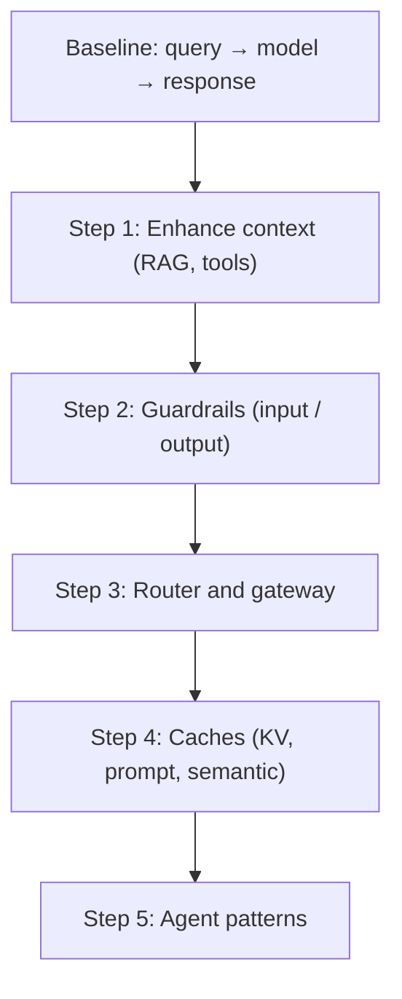
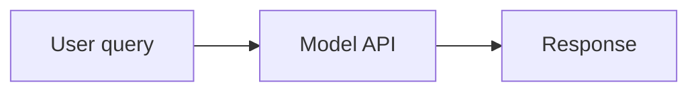
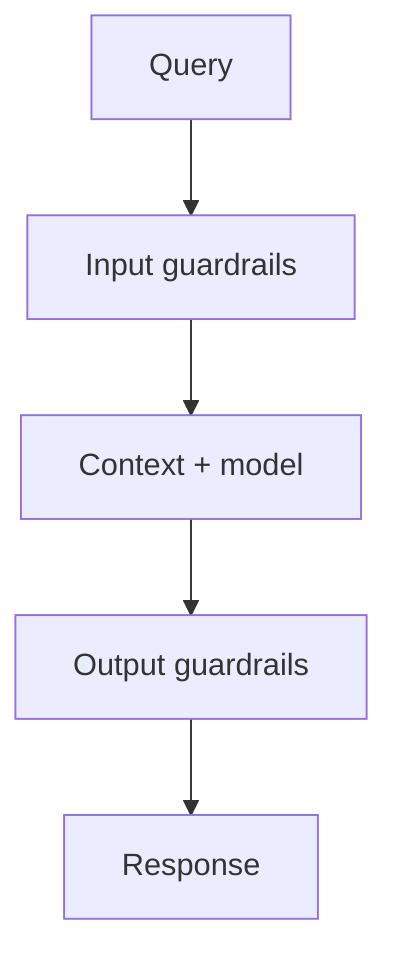
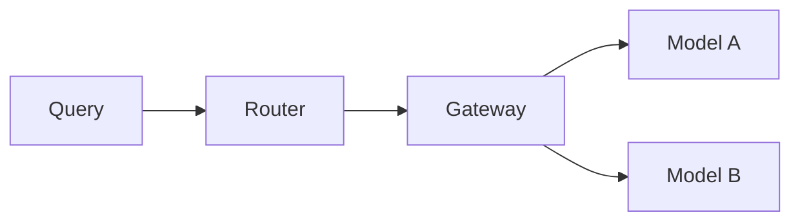
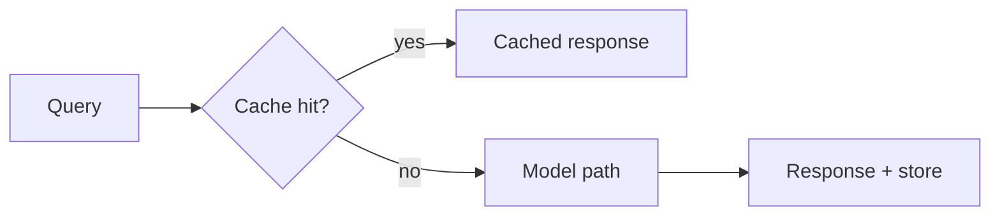
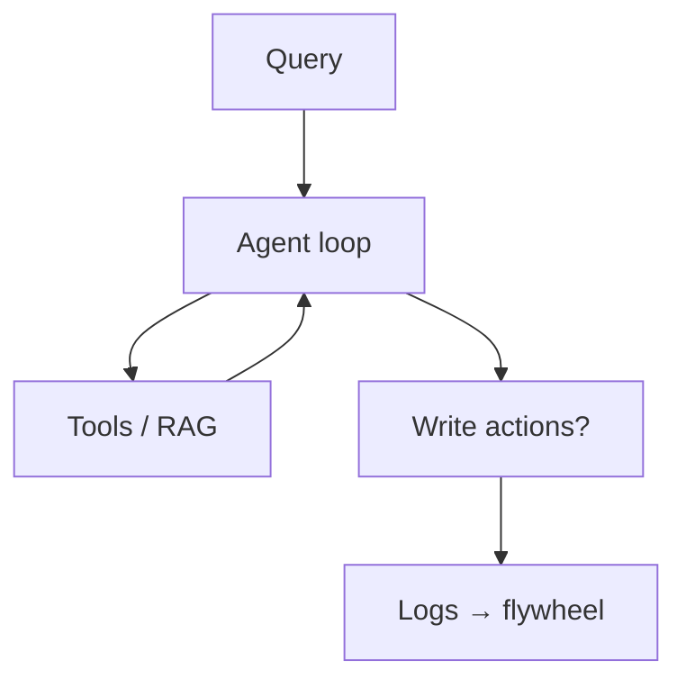

## Introduction

> **O'Reilly (1st ed.)** — Huyen (2025), **Chapter 10**, approximately **pp. 449–494**. Cross-check figures and tables in your PDF.

Previous chapters covered techniques to **adapt** foundation models. This chapter shows how to **assemble** them into production applications—and how **user feedback** becomes a first-class data source for improvement.

The architecture section uses a **gradual build**: simplest path first, then components as needs arise. User feedback is harder to extract in conversational UIs than to collect—design matters for both UX and the data flywheel (Chapter 8).

## Learning objectives

After this chapter, you should be able to:

- Walk through the **five-step progressive architecture** with tradeoffs.
- Place **guardrails** on input vs. output for your risk model.
- Explain **router vs. gateway** responsibilities.
- Design **feedback** capture that feeds the data flywheel safely.
- Connect monitoring to **new failure modes** of foundation models.

---

## AI engineering architecture

A validated pattern at many companies—your app may diverge, but the components recur.

### Baseline: query → model → response

User query → model API (third-party or self-hosted, Chapter 9) → response. No context augmentation, guardrails, or optimization (Figure 10-1 in book).

### Step 1. Enhance context

Add retrieval (text, image, tabular) and **tools** (search, weather, APIs)—“feature engineering” for foundation models (Chapter 6).

Provider differences: file upload limits, chunking, parallel tool execution. Specialized RAG stacks vs generic API file features.

### Step 2. Guardrails

Place guardrails wherever risk exists—**input** and **output**.

**Input guardrails**

- **Prompt attacks** (Chapter 5)—cannot eliminate all risk.
- **PII / secrets to third-party APIs** — employee paste, system prompts with internal policy, tools pulling private DB rows. Mitigate with detection (IDs, faces, keywords); **block** or **mask** with reverse map for unmasking in responses (Figure 10-3 in book). Example: Samsung employee leaking secrets via ChatGPT.

**Output guardrails**

- Catch failures; define handling policy.
- **Quality:** malformed JSON, hallucinations, generally bad outputs (Chapters 4–5).
- **Security:** toxicity, PII leakage, unsafe tool/code execution, brand risk. Track **false refusal rate** too.
- **Retries:** probabilistic models—retry on empty/malformed output (latency/cost trade-off); **parallel calls** pick best response faster.
- **Human escalation:** keywords, sentiment anger, max turns stuck in loop.

**Trade-offs:** guardrails add **latency**; some teams skip them for speed. **Streaming** hard to guard on partial tokens. Third-party APIs ship built-in safety; self-hosting reduces external PII exposure but you own more guardrails.

**Tools:** Purple Llama, NeMo Guardrails, Azure PyRIT / content filters, Perspective API, OpenAI moderation; gateways may bundle guardrails.

### Step 3. Model router and gateway

**Router** — route by intent instead of one model for everything:

- Specialized models (billing vs troubleshooting).
- Cheaper models for simple queries.
- Out-of-scope decline without API call.
- Clarify ambiguous queries (“Freezing” → account vs weather).
- **Next-action** routing for agents (code interpreter vs search).
- **Memory routing** (attached doc vs web).
- Context limit changes after retrieval—truncate or switch to larger-context model.

Implement with small LMs (BERT, Llama 7B) or tiny classifiers—must be **fast and cheap**. Common pattern: **routing → retrieval → generation → scoring**.

**Gateway** — unified interface to OpenAI, Gemini, self-hosted, etc.:

- Single code path when APIs change.
- **Access control** and cost caps (no org-wide API keys on laptops).
- **Fallback** on rate limits/outages.
- Load balancing, logging, analytics, caching, guardrails.

Examples: Portkey, MLflow AI Gateway, TrueFoundry, Kong, Cloudflare. Gateway **replaces** the raw “model API” box in diagrams.

### Step 4. Reduce latency with caches

Beyond **KV cache** and **prompt cache** (Chapter 9)—**system caching**:

| Type | Match rule | Risk |
|------|------------|------|
| **Exact** | Identical query/context | **Personalized answers cached for wrong user** (return policy + membership) |
| **Semantic** | Embedding similarity above threshold | Wrong cache hit; embedding/search quality; cost of vector lookup |

Exact cache: product summaries, embedding search results, multi-step chains. Backends: Redis, PostgreSQL, LRU/LFU/FIFO eviction. Classifier can predict cacheability—skip user-specific or time-sensitive (“weather”).

Semantic cache: higher hit rate, can **hurt quality** if threshold wrong.

### Step 5. Agent patterns

Loops (retrieve again after failed answer), parallel branches, **write actions** (email, orders, transfers)—high capability, high risk (Chapter 6). Architecture feeds outputs back into the pipeline (Figures 10-9–10-10).

Complexity → more failure modes → observability becomes critical.

---

## Monitoring and observability

Observability should be **designed in**, not bolted on. Goal aligns with **evaluation** (Chapter 4): mitigate risk, find opportunities, stay accountable.

**DevOps-style health:**

- **MTTD** — mean time to detect issues.
- **MTTR** — mean time to resolve.
- **CFR** — change failure rate; high CFR may mean weak pre-deploy eval.

**What to log (minimum viable observability):**

- Request/response payloads (redacted), model id, temperature, token counts, latency (TTFT + total).
- Retrieval ids / tool calls / agent steps (for RAG and agents).
- User feedback events linked to `trace_id`.
- Errors, rate limits, safety blocks, cost per request.

Eval metrics should **translate** to production monitoring; monitoring findings feed back to eval pipelines.

**Monitoring vs observability:** monitoring tracks external outputs; observability assumes internal state can be inferred from logs/metrics/traces without shipping new code.

### Metrics

Design metrics around **failure modes you care about**—hallucination, cost, format, safety. Application-specific creativity required.

Recap sources: Chapters 3–6, user signals below.

- Format: invalid JSON rate, auto-fixable vs structural errors.
- Quality: factual consistency, conciseness, creativity—often **AI judges**.
- Safety: toxicity, PII, guardrail triggers, refusal rate, abnormal queries.
- **User signals:** stop generation mid-stream, turns per conversation, tokens in/out, output token distribution.
- **RAG:** context relevance, precision; vector DB latency/storage.
- Correlate to **north star** (DAU, session length, subscriptions).
- **Latency:** TTFT, TPOT, total (Chapter 9); per user at scale.
- **Cost:** tokens, TPS, cache hit rate, rate-limit headroom.
- Spot check vs exhaustive evaluation—balance cost and coverage. Break down by user, release, prompt version, time.

### Logs and traces

**Metrics** aggregate; **logs** are append-only events for “what happened five minutes ago?”

Log: configs (model, temperature, top-p), user query, final prompt, output, tool calls, timings, crash IDs/tags.

Log generously—volume grows; AI-assisted log analysis helps; **manual daily sampling** still sharpens intuition (Shankar et al., 2024).

**Traces** link events into one request timeline (LangSmith-style): retrieval steps, prompts, per-step latency/cost. Pinpoint failure: bad routing, bad retrieval, bad generation.

### Drift detection

Watch for:

- **System prompt changes** (template updates, typos fixed by coworkers).
- **User behavior adaptation** (shorter prompts over time → metric shifts need investigation).
- **Silent model version changes** behind same API—GPT-4 March vs June 2023 gaps (Chen et al.); Voiceflow ~10% drop GPT-3.5-0301 → 1106.

---

## AI pipeline orchestration

**Orchestrator** wires models, retrieval, tools, eval, monitoring:

1. **Component definition** — register models (gateway helps), data sources, tools.
2. **Chaining** — compose steps: process query → retrieve → build prompt → generate → evaluate → return or escalate human.

Different from general workflow tools (Airflow)—AI orchestrators focus on LLM pipelines. **LangChain**, LlamaIndex, Flowise, Langflow, Haystack—many RAG/agent frameworks are orchestrators.

**Advice:** build without orchestrator first; add when complexity justifies it. Watch hidden API calls and latency.

| | **Start without orchestrator** | **Add orchestrator (LangChain, etc.)** |
| --- | --- | --- |
| **Pros** | Fewer abstractions; easier debug; lower latency | Reusable chains, community patterns |
| **Cons** | Spaghetti as steps grow | Hidden LLM calls; harder to trace cost |
| **When** | ≤3 steps, one team, clear code | Many branches, tools, shared components |

**Evaluate:** integration/extensibility, branching/parallel/error handling, UX/docs/community, scale.

**Latency tip:** parallelize independent steps (routing + PII scrubbing).

---

## User feedback

Feedback drives **evaluation** and **development**; in AI it is also **proprietary training data** for the flywheel. Open-source deployments make collection harder (users self-host without telemetry).

Treat feedback as **user data**—privacy, consent, transparency.

### Explicit vs implicit

| Signal class | Examples | Extraction |
| --- | --- | --- |
| **Explicit** | Thumbs, stars, surveys | Direct labels |
| **Implicit** | Regenerate, abandon, time-on-page | Behavioral logs |
| **Natural language** | “No, I meant…”, complaints | NLP on messages |
| **Actions** | Edit answer, share, delete thread | Event pipeline |

| Type | Examples |
|------|----------|
| **Explicit** | Thumbs up/down, stars, “Did we solve your problem?” |
| **Implicit** | Purchases, edits, regeneration, conversation deletes |

Conversational UIs enable rich **natural language feedback**—corrections like dialogue (“No, I meant…”, “Book the one near galleries”).

Uses: **monitoring metrics**, **model development**, **personalization**.

### Extracting conversational feedback

**Natural language (content):**

- **Early termination** — stop generation, leave hanging.
- **Error correction** — “No…”, “I meant…”, rephrases.
- **Action correction** — “Also check their GitHub.”
- **Confirmation requests** — “Are you sure?” — may mean missing detail or distrust.
- **User edits** — strong signal; edits → preference pairs (losing = model, winning = edit).
- **Complaints** — wrong, verbose, toxic (FITS dataset clusters, Xu et al., 2022; Yuan et al., 2023).
- **Sentiment** — frustration without specifics; model **refusal rate** as negative signal.

**Actions (non-message):**

- **Regeneration** — dissatisfaction or A/B curiosity; stronger signal under usage-based billing.
- **Organization** — delete (bad), rename (good title needed), share (ambiguous).
- **Length & diversity** — long support chat vs companion; repeated lines = loop.

Combine signals; RL/NLP feedback research predates ChatGPT (Fu et al., 2019; Alexa, Spotify voice).

### Feedback design

**When to collect**

- **Onboarding** — calibration (face/voice/skill); optional where possible.
- **On failure** — downvote, regenerate, switch model, human handoff; inpainting-style collaboration (DALL-E).
- **Low confidence** — side-by-side summaries; Google Photos “same person?”; comparative preference data.
- **Positive moments** — controversial; Apple HIG warns against asking praise by default; some teams sample 1% for “amazing” signals.

**How to collect**

- Seamless, ignorable, incentivized.
- **Midjourney:** 4 images → upscale / variations / regenerate = graded implicit preference.
- **Copilot:** Tab accept vs keep typing.
- **Integrated products** (Gmail drafts) beat standalone ChatGPT for outcome-linked feedback.
- Context (5–10 turns) needs **consent** for PII; terms of service or donation checkbox.
- Explain use: personalization vs aggregate stats vs training.
- Don’t ask impossible comparisons (stats questions aren’t “preference”).
- Clear UI—avoid emoji rating traps (Luma 1-star vs 5-star confusion).
- **Public vs private** feedback changes behavior (X private likes).

### Feedback limitations

**Biases:** leniency (Uber 4.8 average), random clicks, **position bias** (mitigate shuffle or modeling), length/recency preference in side-by-side.

> **Degenerate feedback loop (callout):** Optimizing on clicks or thumbs-up can amplify popularity bias (filter bubbles) and **sycophancy**—models learn to agree with users instead of staying truthful (Sharma et al., 2023; Stray, 2023). Mitigate with slice eval, holdout human review, and caps on how much feedback data enters each training round.

**Degenerate feedback loop:** recommendations amplify clicks → filter bubbles; cat-photo example; **sycophancy** when training on feedback (Sharma et al., 2023; Stray, 2023)—models tell users what they want vs what is true.

Feedback only on **shown** outputs—exposure bias. Understand limits before closing the loop.

---

## Chapter wrap-up

AI engineering is **systems engineering**: modular architecture (context, guardrails, router/gateway, cache, agents) plus **observability** and **feedback design** tied to eval and data strategy.

Separation of components is fluid—guardrails can live in gateway, model host, or standalone. Each layer adds capability and **complexity**.

Engineers increasingly own feedback because it feeds the model improvement loop—AI engineering moves closer to **product** (Chapter 1).

Many challenges need a **whole-system view**—not a single technique in isolation.

---

## Discussion questions

- Which **architecture step** (context, guardrails, router, cache, agents) is missing today?
- Where could **semantic caching** leak personalized answers?
- What **observability** signal would have caught your last incident?
- How do you avoid a **degenerate feedback loop**?
- What feedback do you collect without hurting UX?

---

## Related

- **Back:** [Inference Optimization](/ai-engineering/docs/inference-optimization) — latency/cost under load.
- **Capstone:** [Introduction to Building AI Applications](/ai-engineering/docs/introduction-to-building-ai-applications-with-foundation-models) — stack and planning from Chapter 1.
- **Feedback data:** [Dataset Engineering](/ai-engineering/docs/dataset-engineering) — turning logs into training sets.
- **Epilogue:** [Epilogue](/ai-engineering/docs/epilogue) — closing perspective and book repo.
- **Book repository:** [chiphuyen/aie-book](https://github.com/chiphuyen/aie-book).
- **Glossary:** [Glossary](/ai-engineering/docs/glossary) — key terms from the book and these notes.

### Capstone: which chapter solves which layer

| Layer / problem | Primary chapters |
| --- | --- |
| **What model & how it behaves** | [2](/ai-engineering/docs/understanding-foundation-models), [5](/ai-engineering/docs/prompt-engineering) |
| **Is it good enough?** | [3](/ai-engineering/docs/evaluation-methodology), [4](/ai-engineering/docs/evaluating-modern-ai-systems) |
| **Private knowledge & tools** | [6](/ai-engineering/docs/rag-and-agents) |
| **Behavior / format in weights** | [7](/ai-engineering/docs/finetuning), [8](/ai-engineering/docs/dataset-engineering) |
| **Fast & cheap at scale** | [9](/ai-engineering/docs/inference-optimization) |
| **Production system & improvement loop** | **10** (this chapter) |

## Closing notes

This chapter is the integration layer: I would sketch the **minimal path** first, then add only components justified by measured failure modes—not every box in Figure 10-10 on day one.

For production, I pair **goodput SLOs** (Chapter 9) with **traces** and a short list of conversational implicit signals (early stop, rephrase, edit distance). Feedback loops get a explicit **bias and sycophancy review** before training.

Gateway + router early saves pain when swapping models or enforcing spend caps. **Semantic cache** I would treat as an experiment with strict quality gates, not a default.

**Reference:** Huyen, C. (2025). *AI engineering: Building applications with foundation models*. O’Reilly Media. Chapter 10: AI Engineering Architecture and User Feedback.

---

## References

Huyen, C. (2025). *AI engineering: Building applications with foundation models*. O’Reilly Media. Chapter 10: AI Engineering Architecture and User Feedback.

### Architecture, gateways, and guardrails

- [NeMo Guardrails](https://github.com/NVIDIA/NeMo-Guardrails) — NVIDIA.
- [Purple Llama](https://ai.meta.com/purple-llama/) — Meta safety stack.
- [Portkey AI Gateway](https://github.com/Portkey-AI/gateway)
- [MLflow AI Gateway](https://mlflow.org/docs/latest/llms/gateway/index.html)
- [OpenAI Moderation API](https://platform.openai.com/docs/guides/moderation)
- [Perspective API](https://perspectiveapi.com/) — Toxicity scoring.

### Orchestration and observability

- [LangChain](https://www.langchain.com/)
- [LlamaIndex](https://www.llamaindex.ai/)
- [LangSmith](https://www.langchain.com/langsmith) — Tracing (Figure 10-11 in book).
- [OpenTelemetry](https://opentelemetry.io/) — Traces/metrics/logs standard.
- [Weights & Biases — LLM monitoring](https://wandb.ai/site/solutions/llmops)
- [Arize Phoenix](https://github.com/Arize-ai/phoenix) — LLM eval and tracing.

### Caching and routing

- [GPTCache](https://github.com/zilliztech/GPTCache) — Semantic cache community patterns.
- [Semantic cache discussion — LangChain](https://python.langchain.com/docs/how_to/semantic_cache/)

### User feedback and preference learning

- [FITS: Feedback for Interactive Talk & Search](https://arxiv.org/abs/2204.10091) — Xu et al. (2022).
- [Learning from Natural Language Feedback](https://arxiv.org/abs/2306.08899) — Yuan et al. (2023).
- [RL from Human Feedback survey](https://arxiv.org/abs/2203.02155) — Ouyang et al. (2022) — InstructGPT context.
- [Towards Understanding Sycophancy in LLMs](https://arxiv.org/abs/2310.13581) — Sharma et al. (2023).
- [Aligning AI with shared human values (RLHF risks)](https://www.alignmentforum.org/) — Stray (2023) and related discourse.

### Model drift and versioning

- [How Is ChatGPT’s Behavior Changing?](https://arxiv.org/abs/2307.09009) — Chen et al. (2023) — GPT-3.5/4 version drift.
- [Voiceflow — model version performance](https://www.voiceflow.com/blog) — GPT-3.5-turbo version notes (cited in book).

### Product design and HCI

- [Apple Human Interface Guidelines — Ratings and reviews](https://developer.apple.com/design/human-interface-guidelines/ratings-and-reviews)
- [Midjourney documentation](https://docs.midtrourney.com/) — Implicit feedback workflow.
- [GitHub Copilot — inline suggestions](https://docs.github.com/en/copilot)

### Monitoring (general)

- [Designing Machine Learning Systems](https://www.oreilly.com/library/view/designing-machine-learning/9781098107956/) — Huyen (2022) — Monitoring chapter; blog draft on distribution shift.
- [Datadog / Splunk / Dynatrace](https://www.datadoghq.com/) — Enterprise observability (market context in book).

### Courses and workshops

- [Full Stack LLM Bootcamp — production LLM apps](https://fullstackdeeplearning.com/llm-bootcamp/) — Architecture patterns.
- [DeepLearning.AI — Building Systems with the ChatGPT API](https://www.deeplearning.ai/short-courses/building-systems-with-chatgpt/) — Pipelines and guardrails intro.
- [UPM — Taller 6: Programación de software con IA (PDF)](https://innovacioneducativa.upm.es/sites/default/files/saga/presentacion-taller6-programacion-software-ia.pdf) — Spanish deployment context.

### Book repository

- [AI Engineering — GitHub (Huyen)](https://github.com/chiphuyen/aie-book) — Observability resources, architecture examples.
