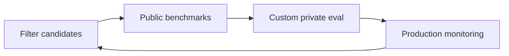

## Introduction

> **O'Reilly (1st ed.)** — Huyen (2025), **Chapter 4**, approximately **pp. 159–210**. Cross-check figures and tables in your PDF.

A model is only useful if it works for **your** application. Chapter 3 surveyed **how** to evaluate (exact metrics, AI judges, comparative ranking). This chapter covers **what** to measure, **how to choose models**, and **how to build a pipeline** you can trust over time.

Three parts:

1. **Evaluation criteria** — domain capability, generation quality, instruction-following, cost and latency.
2. **Model selection** — build vs. buy, public benchmarks, leaderboards, contamination.
3. **Evaluation pipeline** — guidelines, methods, data slices, and iteration in production.

Evaluation must sit in the **system** context: know where failures happen, design measurement around them, and sometimes redesign for visibility.

## Learning objectives

After this chapter, you should be able to:

- Apply the **four evaluation criteria** to a real use case.
- Outline a **model selection workflow** (filter → public → custom → production).
- Argue **build vs. buy** with privacy, latency, and capability tradeoffs.
- Design a three-step **evaluation pipeline** with human spot-checks.
- Map benchmark scores to **business thresholds**, not leaderboard rank alone.

---

## The core philosophy: evaluation-driven development

Which is worse—an app never deployed, or one deployed with **no way to know if it works**? Most practitioners pick the latter: it costs to run, yet ROI stays unknown. Teams ship car-valuation models without accuracy feedback, or support chatbots whose effect on UX remains unclear.

Before investing heavily, define **how success will be measured**. Huyen calls this **evaluation-driven development** (inspired by test-driven development): **define evaluation criteria before building**.

> In AI engineering, evaluation-driven development means defining evaluation criteria before building.
>
> — Huyen (2025, p. 160)

Enterprise production often favors apps with **clear metrics**: recommenders (engagement, purchase-through), fraud (money saved), coding (functional correctness). Many foundation-model use cases are still **close-ended** in practice (intent, sentiment, next-action)—easier to evaluate than open chat.

Focusing only on what is easy to measure is like searching for keys under the lamppost: convenient, not necessarily where value lies. Still, **evaluation is the biggest bottleneck to AI adoption**; reliable pipelines unlock applications that are hard to score today.

An application deployed without evaluable outcomes is a **liability**—it consumes resources without knowable value.

**Concrete EDD example (support bot):** Before building RAG, the team writes: (1) **≥85%** answers rated helpful on 200 real tickets, (2) **zero** policy violations on a red-team set, (3) p95 latency **under 3s**, (4) cost **under $0.02**/conversation. Week 1: baseline GPT + prompt only on 50 tickets—fails helpfulness at 62%. Week 3: add retrieval + rubric judge—hits 81%. Ship only after private set passes all four gates; production logs feed the next eval slice (Ch. 10).

---

## The four pillars of evaluation criteria

Think in four buckets (example: summarize a legal contract):

| Pillar | Question | Example metrics / methods |
|--------|----------|---------------------------|
| **Domain-specific capability** | Does the model understand law / code / medicine? | Private QA set, exact match on IDs, RAG faithfulness |
| **Generation capability** | Is the summary coherent, faithful, safe? | Rubric judge, BLEU/ROUGE where refs exist, human sample |
| **Instruction-following** | Right format, length, constraints? | JSON schema pass rate, tool-call accuracy |
| **Cost and latency** | Affordable and fast enough? | TTFT/TPOT p99, $/1M tokens, MFU on self-host |

### Evaluation pipeline (overview)

| Step | Goal | Pitfall |
| --- | --- | --- |
| **Filter** | Drop obviously wrong models cheaply | Over-trusting one public score |
| **Public benchmarks** | Broad capability signal | Contamination, not your distribution |
| **Custom eval** | Mirror real prompts + rubrics | Stale set; no slice analysis |
| **Production** | Drift, regressions, incidents | No link to offline eval ([Ch. 10](/ai-engineering/docs/ai-engineering-architecture-and-user-feedback)) |

Chapter 3 asked “what can this **method** measure?” Here we ask “given this **criterion**, which methods apply?”

### Domain-specific capability

Coding agents need code competence; Latin–English apps need both languages. Capabilities are bounded by **architecture, size, and training data**—a model never trained on Latin cannot understand it.

**Measurement:** domain benchmarks (public or private). Coding often uses **functional correctness** (HumanEval, MBPP, Spider, BIRD-SQL); BIRD-SQL also scores **query efficiency** (runtime vs. ground-truth SQL). **Readability** has no exact metric—use AI judges.

Non-code domains often use **multiple-choice** benchmarks (MMLU, AGIEval, ARC-C). MCQs are easy to verify; random baseline with four options is 25%. Caveats: scores shift with tiny prompt changes (extra space, “Choices:”); MCQs test **classification of good vs. bad**, not **generation**—fine for knowledge/reasoning, weak for summarization or essays.

### Generation capability

NLG historically tracked **fluency** and **coherence**; strong LMs made surface fluency less discriminating. New priorities: **hallucinations** (undesired for factual tasks), **safety** (toxicity, bias, harm), plus app-specific traits (controversiality, conciseness, friendliness).

**Factual consistency**

- **Local** — output supported by **given context** (RAG, support bots, summaries vs. source).
- **Global** — output vs. **open knowledge** (general chat, fact-checking); hardest part is deciding what counts as fact.

Techniques: **AI-as-judge** prompts; **SelfCheckGPT** (many samples—expensive); **SAFE** (decompose claims, search, verify); **NLI/entailment** classifiers (entailment / contradiction / neutral); benchmarks like **TruthfulQA** (human falsehood traps).

Design benchmarks around **where your model hallucinates** (niche topics, questions about things that never happened).

**Safety**

Categories include inappropriate language, harmful how-tos, hate speech, violence, stereotypes, ideological bias. Use **moderation APIs**, small **toxicity classifiers** (Perspective, etc.), or prompted general models. Benchmarks: RealToxicityPrompts, BOLD.

### Instruction-following capability

If the model outputs HAPPY instead of POSITIVE/NEUTRAL for sentiment, domain skill may be fine but **instruction-following** fails. Critical for **JSON**, regex, length limits, vocabulary pools (e.g. children’s reading levels).

Hard to separate from domain or generation quality—and from **prompt quality** (bad instruction vs. bad model).

**IFEval** — 25+ **automatically verifiable** format rules (keywords, word count, JSON, bullets). **INFOBench** — broader content/style constraints verified via yes/no criteria (human or AI). Strong on public benchmarks ≠ strong on **your** instructions; curate YAML, “don’t say As a language model…”, etc.

**Roleplaying** (gaming NPCs, companions): hard to automate; RoleLLM, CharacterEval; heuristics + AI judges for style and **knowledge** (including what the character must *not* know).

### Cost and latency

A perfect model that is too slow or costly fails in production. Filter by **hard** latency ceilings, then optimize quality among survivors. Metrics: **TTFT**, time per token, total query time; cost per token (API) vs. fixed cluster cost (self-host—marginal cost can fall with scale).

Ask whether latency is **must-have** or **nice-to-have**; users rarely refuse lower latency, but it is not always a dealbreaker.

---

## Model selection workflow

You care about the **best model for your app**, not the global #1. Re-select as you change prompts, RAG, or finetuning.

**Hard vs. soft attributes**

- **Hard** — license, privacy policy, model size, hosted vs. API (cannot or will not change).
- **Soft** — accuracy, toxicity, factual consistency (prompting, decomposition, finetuning may help).

Accuracy can jump from 20% to 70% after task decomposition—or stay unusable after weeks; know when to abandon a model.

### Step 1: Build vs. buy

First filter: **commercial API** vs. **self-hosted open weights** (including APIs on open models in your VPC).

| Axis | API | Self-host |
|------|-----|-----------|
| **Privacy** | Data leaves your network; policy can change (Zoom 2023) | Data stays internal; lineage risk on you |
| **Data lineage / IP** | Contracts may offer indemnification | Infringer often pursued as deployer |
| **Performance** | Top SOTA often proprietary | Gap closing; best open weights may trail best closed |
| **Functionality** | Scaling, tools, structured outputs; often **no logprobs** | Logprobs, full finetune control; you build guardrails |
| **Cost** | Pay per token; negotiable at scale | Engineering + GPUs; can win at huge volume |
| **Control** | Rate limits, silent updates, over-censorship | Freeze weights; you maintain serving |
| **Edge** | Needs network | On-device possible (hard) |

**Open source vs. open weight vs. open model** — weights public ≠ training data public. Licenses matter: commercial use, MAU caps (Llama), distillation from outputs.

> A 2024 a16z study found enterprises value open models especially for **control** and **customizability**.
>
> — Huyen (2025, p. 189)

Strongest models often stay **API-only**; weaker ones are open-sourced. Same model via different providers can differ (optimizations)—**test when switching**.

### Step 2: Navigate public benchmarks

Thousands of benchmarks (BIG-bench 214 tasks; lm-evaluation-harness 400+). Use them for a **directional shortlist**, not truth.

**Leaderboards** aggregate few benchmarks (compute limits). Hugging Face Open LLM Leaderboard vs. HELM Lite chose different sets—coverage is subjective. **Correlate benchmarks**—if two measure the same thing, don’t double-count. Average scores treat 80% on TruthfulQA like 80% on GSM-8K; HELM uses **mean win rate** across scenarios instead.

**Custom public leaderboard:** pick benchmarks matching your app (code → HumanEval; writing → creative sets). Scores missing? Run harness yourself (HELM full run ~$80k–$100k cited for 30 models).

**Data contamination** — training on test data inflates scores (“pretraining on the test set is all you need” satire). Common via web scrape. Detect: **n-gram overlap** with training data, suspiciously **low perplexity** on benchmark text. Contamination undermines trust; a model that aces bar exams may still give bad legal advice.

> Data contamination happens when a model was trained on the same data it’s evaluated on, causing higher scores than deserved.
>
> — Huyen (2025, p. 197)

**Never trust public benchmarks as sole source of truth.** Use them to **filter out bad models**, then validate privately.

Model updates can shift benchmark scores (GPT-3.5/4 March–June 2023 study)—“model got worse” often reflects **eval difficulty** and **your task**, not universal degradation.

### Step 3: Design your custom pipeline

This is your **source of truth**.

**3a. Evaluate all components**

End-to-end **and** per-step (PDF extract → employer extract). **Per turn** vs. **per task** (debugging chat: did we fix the bug in 2 turns or 20?). Task boundaries are fuzzy in real chats.

**3b. Create an evaluation guideline**

Define what the app **should** and **should not** do (out-of-scope election questions in a product bot?). **Correct ≠ good**: LinkedIn Job Assessment—“terrible fit” may be correct but harmful; good answers explain gaps and next steps.

Per criterion: scoring system (binary, 1–5, entailment classes) + **rubric with examples**; validate with humans. **Tie to business metrics**: e.g. 80% factual consistency → automate 30% of tickets; 98% → 90%. Set **usefulness thresholds** (below 50% consistency, unusable even for general queries).

**3c. Methods and data**

Mix methods: cheap toxicity classifier on 100%, expensive AI judge on 1%. Use **logprobs** when available (classification confidence, PPL). Humans remain **north star**—e.g. LinkedIn reviewing hundreds of conversations daily.

**Curate evaluation sets** from production; label with humans or AI (Chapter 8). **Slice data**: paying vs. free, mobile vs. web, long inputs, typos, known failure buckets, out-of-scope prompts—avoid **Simpson’s paradox** (model A wins overall but loses every subgroup).

Bootstrap sample size for stability; OpenAI rule of thumb for 95% confidence: ~10 samples to detect 30% gap, ~100 for 10%, ~1,000 for 3%, ~10,000 for 1%. Median harness benchmark ~1,000 examples.

**Evaluate the evaluator:** Do higher scores mean better outputs and business outcomes? Reproducibility (temperature 0 for judges)? Metric correlation? Cost/latency of eval itself?

**Iterate** criteria and rubrics as the product evolves—but track configs so month-over-month comparisons stay meaningful.

### Step 4: Monitor in production

Continual monitoring, failure detection, and user feedback (Chapter 10). Workflow steps are **iterative**—build vs. buy may flip after private eval.

---

## Chapter wrap-up

Chapter 4 connects criteria to **selection** and **pipelines**: four evaluation pillars, evaluation-driven development, a four-step model workflow (filter → public benchmarks → custom eval → production), build/buy tradeoffs, benchmark contamination, and building guidelines, rubrics, slices, and mixed automatic/human methods.

No single score captures a high-dimensional system; **combining methods** mitigates blind spots. Dedicated evaluation chapters end here, but eval recurs in retrieval/agents (Ch. 6), finetuning and cost (Ch. 7–9), data quality (Ch. 8), and production feedback (Ch. 10). Next: **prompt engineering**.

---

## Discussion questions

- Draft four **evaluation pillars** (domain, generation, instruction, cost/latency) for your product.
- What is on your **private eval set** that MMLU will never see?
- Where could **contaminated** public benchmarks mis-rank models for you?
- Write a one-paragraph **evaluation guideline** like the LinkedIn “helpfulness” example.
- What **usefulness threshold** gates automation vs. human review?

---

## Related

- **Back:** [Evaluation Methodology](/ai-engineering/docs/evaluation-methodology) — methods this chapter operationalizes.
- **Next:** [Prompt Engineering](/ai-engineering/docs/prompt-engineering) — first adaptation layer after you pick a model.
- **Data:** [Dataset Engineering](/ai-engineering/docs/dataset-engineering) — building slices that match production.
- **Agents:** [RAG and Agents](/ai-engineering/docs/rag-and-agents) — evaluating retrieval and tool loops.
- **Book repository:** [chiphuyen/aie-book](https://github.com/chiphuyen/aie-book).
- **Glossary:** [Glossary](/ai-engineering/docs/glossary) — key terms from the book and these notes.

## Closing notes

What I internalize from this chapter is a discipline shift: **define success before building**. The four pillars remind me not to optimize only accuracy on a leaderboard—domain fit, output quality, instruction adherence, and economics all gate shipping.

**Build vs. buy** is strategic, not religious: privacy and control push self-host; SOTA and time-to-market push APIs; contamination and leaderboard averaging push me toward a **private eval set** that mirrors real prompts, slices, and business thresholds. Public MMLU or Arena rank is a **filter**, not a contract.

The LinkedIn “terrible fit” example sticks: evaluation guidelines must encode **helpfulness**, not just truth. I would stage a pipeline like the text-to-SQL pattern from Chapter 3—functional checks first, scalable judges second, human review on the tail—and treat the eval harness itself as a product: bootstrap stability, frozen judge specs, and explicit mapping from consistency % to tickets automated.

> Not having a reliable evaluation pipeline is one of the biggest blocks to AI adoption.
>
> — Huyen (2025, p. 208)

---

## References

Huyen, C. (2025). *AI engineering: Building applications with foundation models*. O’Reilly Media. Chapter 4: Evaluate AI Systems.

### Holistic evaluation

- [HELM](https://crfm.stanford.edu/helm/latest/) — Liang et al., Stanford holistic benchmarking.
- [OpenAI — Evals guide](https://platform.openai.com/docs/guides/evals) — Product-oriented eval workflows.

### Model selection and benchmarks

- [MMLU](https://arxiv.org/abs/2009.03300) — Hendrycks et al. (2020).
- [Chatbot Arena](https://chat.lmsys.org/) — Comparative ranking (LMSYS).
- [Data Contamination in LLMs](https://arxiv.org/abs/2310.17589) — Sainz et al. (2023).

### Build vs. buy and production

- [Hugging Face — Model Hub](https://huggingface.co/models) — Open weights and cards.
- [vLLM](https://github.com/vllm-project/vllm) — High-throughput serving for self-hosting comparisons.

### Practitioner essays

- [Greg Brockman on evals](https://x.com/gdb) — “Evals are surprisingly often all you need” (search talks/posts for context).

### Courses

- [UPM — Taller 6 PDF](https://innovacioneducativa.upm.es/sites/default/files/saga/presentacion-taller6-programacion-software-ia.pdf) — Spanish workshop on AI-assisted software.
