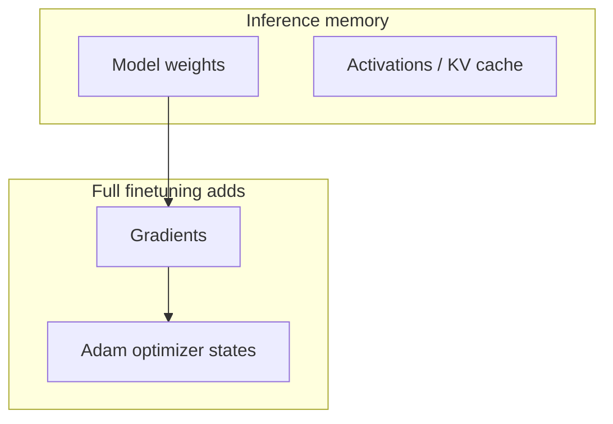

## Introduction

> **O'Reilly (1st ed.)** — Huyen (2025), **Chapter 7**, approximately **pp. 307–362**. Cross-check figures and tables in your PDF.

Chapters 5–6 adapt models through **prompts, context, and tools** without changing weights. **Finetuning** adapts by **further training** the whole model or part of it—adjusting weights.

> Finetuning is the process of adapting a model to a specific task by further training the whole model or part of the model… by adjusting its weights.
>
> — Huyen (2025, p. 307)

It can improve **domain capability**, **safety**, and especially **instruction-following** (formats, styles). It demands more **up-front investment** than prompting: data, hardware, ML talent, serving, and ongoing maintenance.

This chapter is the most technically dense in the book. Skip sections that are not relevant to your role; the book’s GitHub repo lists ML refreshers.

## Learning objectives

After this chapter, you should be able to:

- Decide **when to finetune** vs. prompt/RAG using the book’s criteria.
- Estimate **memory** for inference vs. full finetune vs. **PEFT**.
- Contrast **PTQ** and **QAT** for deployment.
- Explain **model merging** use cases and risks.
- Plan hyperparameter and data tactics that avoid **overfitting** small sets.

---

## Finetuning overview

Start from a **base model** with partial capabilities; finetuning aims for strong enough performance on your task.

### Transfer learning and sample efficiency

Finetuning is one form of **transfer learning** (Bozinovski & Fulgosi, 1976): knowledge from a source task accelerates a related target task—like piano skills helping another instrument.

For LLMs, **pre-training** on next-token prediction (abundant data) transfers to specialized tasks (legal QA, text-to-SQL) with **far fewer labeled examples**—sometimes hundreds vs millions from scratch.

OpenAI’s **InstructGPT** framing: finetuning **unlocks capabilities already in the model** that are hard to reach via prompting alone.

**Feature-based transfer** (embeddings + classifier head) is common in vision; finetuning updates weights directly.

### Types of finetuning

| Type | Data | Purpose |
|------|------|---------|
| **Continued pre-training** | Raw domain text (self-supervised) | Domain language before expensive labels |
| **Supervised finetuning (SFT)** | `(input, output)` pairs | Align to instructions, formats, tasks |
| **Preference finetuning** | `(instruction, winner, loser)` | RLHF-style alignment |
| **Long-context finetuning** | Long sequences | Extend context (architecture changes, e.g. position embeddings) |

**Code Llama** (Rozière et al., 2024) illustrates stacking: base Llama 2 → continued pre-training → long-context extension → instruction tuning.

**Who finetunes:** model developers (post-training before release) and **application developers** (often on already post-trained checkpoints).

---

## When to finetune (and when not)

Finetuning needs **significantly more resources** than prompting—try extensive prompt/RAG experiments first. The approaches are **not mutually exclusive**.

### Reasons to finetune

- **Quality** — JSON/YAML structure, dialect-specific SQL, customer-specific patterns.
- **Bias mitigation** — curated finetuning data can counter training biases (with care).
- **Distillation** — small model imitating a larger one on a task (Chapter 8).
- **Cost/latency at scale** — Grammarly reported Flan-T5 beating a GPT-3 variant at 1/60th size with ~82k instruction pairs.

Smaller open models make finetuning more attractive than in the early API-only era.

### Reasons not to finetune

- **Alignment tax** — gains on one task can hurt others (finetune on all tasks you care about, or use separate models / merging).
- **High cost** — annotation, expertise, serving, monitoring, re-basing when new foundation models ship.
- **Alternatives** — prompts, structured outputs (Chapter 2), RAG for facts.
- **General models catch up** — e.g. GPT-4-0314 outperformed **BloombergGPT** on financial benchmarks despite Bloomberg’s costly 50B training (Li et al., 2023).

Many teams discover weak prompt experiments drove “we need finetuning” claims—systematic eval (Chapter 4) often fixes enough.

### Finetuning vs. RAG: form vs. facts

> Finetuning is for **form**, and RAG is for **facts**.
>
> — Huyen (2025, p. 317)

| Failure type | Symptom | Lean toward |
|--------------|---------|-------------|
| **Information-based** | Wrong or outdated facts; missing private knowledge | **RAG** (start with BM25, then embeddings) |
| **Behavior-based** | Correct but irrelevant; wrong format/style; weak DSL | **Finetuning** |

**Ovadia et al. (2024):** for current-events QA, RAG beat finetuning; RAG on base often beat RAG on finetuned models—but **RAG + finetune** helped ~43% of the time on MMLU categories.

**Recommended path when both issues exist:** start with **RAG** for facts (e.g. legal summaries from case law), then **finetune** for proprietary XML format.

> **Legal / format callout:** For regulated domains, **RAG** grounds answers in citable sources first; **finetuning** then teaches output **schema** (e.g. firm-specific XML tags) without asking the model to memorize every statute in weights. Skipping RAG and finetuning tone-only still leaves factual liability exposed (Ch. 3 eval).

**Workflow (after eval pipeline exists):**

1. Prompting (Chapter 5), add few-shot examples.
2. RAG if missing information (simple retrieval first).
3. Advanced RAG or finetuning by failure mode.
4. Combine both if justified.

---

## Memory bottlenecks

> For foundation models, memory is a bottleneck for working with them, both for inference and for finetuning.
>
> — Huyen (2025, p. 320)

Finetuning memory ≫ inference memory because **backpropagation** runs in training.

### Key contributors

1. **Parameter count** and **trainable parameter count**
2. **Numerical precision** (FP32, FP16, BF16, INT8, INT4…)
3. **Adam optimizer** — **two extra values per trainable parameter** (momentum states)

Per trainable parameter in backward pass: **gradient** + optimizer states.

### Back-of-the-napkin math

**Inference** (forward only):

`memory ≈ num_params × bytes_per_param × 1.2`

The 1.2 factor covers activations/KV (rough; grows with context and batch).

Example — **13B model, FP16 (2 bytes):**  
13×10⁹ × 2 × 1.2 ≈ **31.2 GB**

**Full finetuning training** (trainable = all params, Adam, FP16):

`training ≈ weights + activations + gradients + optimizer_states`

For each trainable param with Adam in 16-bit: gradient (1) + optimizer states (2) → **3 values × 2 bytes = 6 bytes** per trainable param (plus weights).

Example — **7B full finetune, FP16:**

- Weights: 7B × 2 = **14 GB**
- Gradients + Adam states: 7B × 3 × 2 = **42 GB**
- Subtotal ≈ **56 GB** (activations can dominate; use **gradient checkpointing** to recompute)

**PEFT** reduces trainable params → much smaller gradient/optimizer memory.

### Quantization

> Reducing precision, also known as quantization, is a cheap and extremely effective way to reduce a model's memory footprint.
>
> — Huyen (2025, p. 328)

- **PTQ (post-training quantization):** quantize after training—common for inference (LLM.int8, 4-bit serving).
- **QAT (quantization-aware training):** simulates low precision during training for better low-bit quality.
- **Mixed precision training:** higher precision for sensitive ops (weights/loss), lower for activations/gradients.

**Load models in their intended dtype** (e.g. Llama 2 in **BF16**, not FP16—quality drops).

---

## Finetuning techniques

### Full vs. partial vs. PEFT

- **Full finetuning:** all parameters trainable (= pre-training-scale memory).
- **Partial:** freeze early layers—parameter-inefficient (~25% of BERT-large params for GLUE parity in Houlsby et al., 2019).
- **PEFT:** performance near full finetune with **orders of magnitude fewer** trainable parameters.

**PEFT buckets:**

1. **Adapter-based (additive)** — small modules (Houlsby adapters; **LoRA** dominant).
2. **Soft prompt-based** — trainable continuous “soft” tokens (prefix-tuning, prompt tuning, P-tuning).

### LoRA (Low-Rank Adaptation)

Frozen weight matrix **W**; train low-rank update **ΔW = B × A** (rank **r**). Forward: `h = W₀x + BAx`. After training, merge: **W′ = W₀ + (α/r)BA** — **no extra inference latency** when merged.

**Why it works:** LLMs have many parameters but **low intrinsic dimension** after pre-training—larger models often easier to adapt with small updates and small data (Li et al., 2018; Aghajanyan et al., 2020; Hu et al., 2021).

**Where to apply:** commonly **Wq, Wk, Wv, Wo** in attention; Databricks reported strong gains from **feedforward** LoRA too. With fixed trainable budget, rank allocation across matrices matters (Hu et al., 2021 on GPT-3 175B). Typical **r: 4–64** (task-dependent; overfitting possible at very high r).

| Hyperparameter | Typical range | Notes |
| --- | --- | --- |
| **Rank r** | 4–64 | Higher r → more capacity, more overfit risk |
| **Alpha α** | Often 2× r | Scales merged update: W′ = W₀ + (α/r)BA |
| **Target modules** | Wq, Wk, Wv, Wo (+ FFN optional) | Match task: attention vs FFN ablations |
| **Dropout** | 0–0.1 on adapters | Regularize small datasets |
| **LR** | ~1e-4 – 3e-4 (task-dependent) | Lower than full finetune |

**Multi-LoRA serving:** one frozen base **W** + many small (A, B) adapters—see [Chapter 9](/ai-engineering/docs/inference-optimization) for serving cost and [Chapter 8](/ai-engineering/docs/dataset-engineering) for SFT data quality. one frozen base **W** + many small (A, B) adapters—far less storage than 100 full merged models; fast adapter swap (e.g. per-customer adapters).

**QLoRA:** base weights in **4-bit (NF4)**; compute forward/backward in BF16; **paged optimizers** for CPU/GPU spillover—**65B on one 48 GB GPU** (Dettmers et al., 2023). Tradeoff: quantization/dequantization time.

### Model merging (experimental)

Combine multiple finetuned models into one more useful model—not the same as **ensembling** (multiple forward passes).

**Use cases:** multi-task without catastrophic forgetting, on-device memory savings, federated learning, **model upscaling** (e.g. SOLAR 10.7B from 7B via depthwise scaling).

**Approaches:**

| Approach | Idea | Notes |
|----------|------|-------|
| **Summing / averaging** | Weighted average of models or **task vectors** (finetuned − base) | Task arithmetic: add/subtract capabilities |

**Task arithmetic example:** Let **τ** = (finetuned weights − base). To add “Spanish” and subtract “toxic” capabilities from two adapters: **W_new = W_base + λ₁τ_spanish − λ₂τ_toxic** (coefficients tuned on a small eval set). Ilharco et al. (2022) show this can work without retraining a full merge—still validate on **your** slices before shipping.
| **SLERP** | Interpolate on a sphere between two models | Pairs well for two checkpoints |
| **TIES / DARE** | Prune redundant task-vector params before merge | Reduces interference |
| **Layer stacking (frankenmerge)** | Stack layers from different models | Often needs more finetuning (Goliath-120B) |
| **MoE from dense** | Duplicate layers + router (Komatsuzaki et al.) | Sparse upcycling |
| **Concatenation (LoRA)** | Merged rank = r₁ + r₂ | Usually **not** recommended for memory |

---

## Practical finetuning tactics

### Base model and development paths

**Progression path** (OpenAI-style):

1. Cheapest model — debug **code**.
2. Middling model — debug **data** (loss should decrease).
3. Best model — push performance; map **price/performance frontier**.

**Distillation path:**

1. Strong model + **small** curated set.
2. Generate synthetic training data.
3. Train **cheaper** student.

### Frameworks

- **APIs** — fast, limited knobs/models.
- **Frameworks:** LLaMA-Factory, **PEFT**, **unsloth**, Axolotl, LitGPT; full finetune often from model’s own training repo.
- **Distributed:** DeepSpeed, PyTorch Distributed, ColossalAI.

Start with **LoRA**; attempt full finetune when justified. LoRA shines when serving **many adapters** on one base.

### Key hyperparameters

| Hyperparameter | Role | Practical notes |
|----------------|------|-----------------|
| **Learning rate** | Step size for weight updates | Often try 1e-7 to 1e-3; unstable loss → too high; slow decrease → too low; use schedules |
| **Batch size** | Examples per update step | Larger = stabler but more memory; **gradient accumulation** simulates large batch |
| **Epochs** | Passes over data | Millions of examples: 1–2 epochs; thousands: maybe 4–10; watch train vs validation loss for overfitting |
| **Prompt loss weight** | How much loss comes from prompt vs response tokens in SFT | Default often ~10% on prompts |

---

## Chapter wrap-up

Finetuning trades **weight updates** for **memory, data, and ops complexity**. Modern practice centers on **PEFT (LoRA)** and **quantization (QLoRA)** to fit consumer and single-GPU budgets, while **RAG** and prompting handle facts and rapid iteration.

**Model merging** experiments combine specialized checkpoints for multi-task and edge deployment. Chapter 8 addresses the data bottleneck—especially **instruction data**.

---

## Discussion questions

- List **reasons not to finetune** for your current product.
- Estimate **trainable params** and memory with the chapter’s napkin math.
- When is **form** (tone/format) finetuning enough without new facts?
- Would **LoRA vs. full** change your compliance story?
- How will you detect **catastrophic forgetting** on general tasks?

---

## Related

- **Back:** [RAG and Agents](/ai-engineering/docs/rag-and-agents) — prompt-based adaptation first.
- **Next:** [Dataset Engineering](/ai-engineering/docs/dataset-engineering) — data quality for SFT and preferences.
- **Inference:** [Inference Optimization](/ai-engineering/docs/inference-optimization) — serving cost after you adapt weights.
- **Eval:** [Evaluating Modern AI Systems](/ai-engineering/docs/evaluating-modern-ai-systems) — prove finetuning beat prompts/RAG.
- **Book repository:** [chiphuyen/aie-book](https://github.com/chiphuyen/aie-book).
- **Glossary:** [Glossary](/ai-engineering/docs/glossary) — key terms from the book and these notes.

## Closing notes

What I take from this chapter aligns with your class objectives: finetuning is not the default—it is the escalation after **systematic** prompt and RAG work. The InstructGPT idea—that we are **unlocking** behaviors, not inventing them from scratch—changes how I set success criteria: smaller, high-quality datasets and clear format specs often suffice with LoRA.

The **form vs. facts** split is my decision tree: RAG first for hallucinations and private knowledge, finetune for XML/JSON dialects and tone. I would internalize the **memory math** before picking hardware: a 7B full finetune in FP16 with Adam is already ~56 GB before activations, while LoRA + QLoRA exist precisely because that math does not fit a 24 GB GPU.

For production, **multi-LoRA serving** is the business case: one base, many customer adapters. I would track learning rate, batch size with accumulation, and validation loss—and treat merging as research-heavy unless I have clear task-vector semantics.

**Reference:** Huyen, C. (2025). *AI engineering: Building applications with foundation models*. O’Reilly Media. Chapter 7: Finetuning.

---

## References

Huyen, C. (2025). *AI engineering: Building applications with foundation models*. O’Reilly Media. Chapter 7: Finetuning.

### Foundational papers

- [LoRA: Low-Rank Adaptation of Large Language Models](https://arxiv.org/abs/2106.09685) — Hu et al. (2021).
- [QLoRA: Efficient Finetuning of Quantized LLMs](https://arxiv.org/abs/2305.14314) — Dettmers et al. (2023).
- [Training language models to follow instructions (InstructGPT)](https://arxiv.org/abs/2203.02155) — Ouyang et al. (2022).
- [Retrieval-Augmented Generation](https://arxiv.org/abs/2005.11401) — Lewis et al. (2020) — cited for contrast with finetuning.
- [Fine-Tuning or Retrieval? Comparing Knowledge Injection](https://arxiv.org/abs/2312.05934) — Ovadia et al. (2024) — RAG vs finetune on current events.
- [TIES-Merging](https://arxiv.org/abs/2306.01708) — Yadav et al. (2023).
- [Editing Models with Task Arithmetic](https://arxiv.org/abs/2212.04089) — Ilharco et al. (2022).

### Memory and training math

- [Transformer Inference Arithmetic](https://kipp.ly/transformer-inference-arithmetic/) — Carol Chen.
- [Transformer Math 101](https://blog.eleuther.ai/transformer-math-101/) — EleutherAI (Anthony et al., 2023).
- [Reducing Activation Recomputation in Large Transformer Models](https://arxiv.org/abs/2205.05198) — Korthikanti et al. (2022).
- [Mixed Precision Training](https://arxiv.org/abs/1710.03740) — Micikevicius et al. (2017).

### Official guides and courses

- [OpenAI — Fine-tuning best practices](https://platform.openai.com/docs/guides/fine-tuning) — Progression and distillation paths.
- [Hugging Face — PEFT documentation](https://huggingface.co/docs/peft) — LoRA, adapters, soft prompts.
- [Hugging Face — LLaMA-Factory](https://github.com/hiyouga/LlamaFactory) — Multi-model finetuning UI/CLI.
- [unsloth](https://github.com/unslothai/unsloth) — Fast LoRA/QLoRA training.
- [DeepSpeed](https://www.deepspeed.ai/) — ZeRO, memory optimization, distributed training.
- [DeepLearning.AI — Finetuning Large Language Models](https://www.deeplearning.ai/short-courses/finetuning-large-language-models/) — Short course (Andrew Ng / Sharon Zhou).
- [DeepLearning.AI — Efficiently Serving LLMs](https://www.deeplearning.ai/short-courses/efficiently-serving-llms/) — Serving including adapters.
- [UPM — Taller 6: Programación de software con IA (PDF)](https://innovacioneducativa.upm.es/sites/default/files/saga/presentacion-taller6-programacion-software-ia.pdf) — Spanish workshop (related adaptation stack).

### Agent protocols and interoperability (supplementary)

- [A Survey of AI Agent Protocols](https://arxiv.org/abs/2504.16736) — Yang et al. (2025) — MCP, A2A; complements deployment of finetuned adapters.
- [Model Context Protocol (MCP)](https://modelcontextprotocol.io/)

### Model merging and multi-task

- [Model soups](https://arxiv.org/abs/2203.05482) — Wortsman et al. (2022).
- [Git Re-Basin](https://arxiv.org/abs/2209.04836) — Ainsworth et al. (2022) — alignment before merge.
- [MergeKit](https://github.com/arcee-ai/mergekit) — Practical merging toolkit.
- [AdapterHub](https://adapterhub.ml/) — Adapter discovery and sharing.

### Quantization and low-bit inference

- [LLM.int8()](https://arxiv.org/abs/2208.07339) — Dettmers et al. (2022).
- [GPTQ](https://arxiv.org/abs/2210.17323) — Frantar et al. (2022).
- [bitsandbytes](https://github.com/TimDettmers/bitsandbytes) — 8-bit/4-bit utilities used by QLoRA.

### Videos and talks

- [Hugging Face — PEFT + LoRA tutorial (YouTube)](https://www.youtube.com/results?search_query=huggingface+peft+lora+tutorial) — Search for latest official walkthroughs.
- [Andrej Karpathy — Let's build GPT (training intuition)](https://www.youtube.com/watch?v=kCc8FmEb1nY) — Backprop and optimization basics.

### Book repository and lists

- [AI Engineering — GitHub (Huyen)](https://github.com/chiphuyen/aie-book) — Memory calc walkthroughs, finetuning resources.
- [Llama Police — finetuning frameworks list](https://github.com/mlabonne/llm-course) — Community-maintained pointers (verify freshness).
