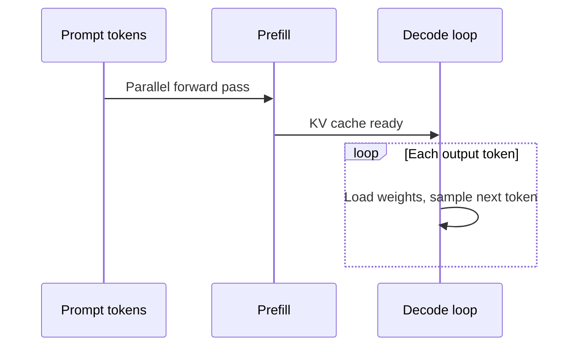

## Introduction

> **O'Reilly (1st ed.)** — Huyen (2025), **Chapter 9**, approximately **pp. 405–448**. Cross-check figures and tables in your PDF.

Better models matter—but if inference is **too slow** or **too expensive**, users leave and ROI collapses. This chapter focuses on making models **faster and cheaper** at the **model**, **hardware**, and **service** levels.

Optimization is interdisciplinary: model researchers, application developers, systems engineers, compiler writers, hardware architects, and data center operators.

Even when you use hosted APIs (OpenAI, Google), understanding these techniques helps you **evaluate providers**, diagnose latency/cost pain, and choose online vs batch modes wisely.

## Learning objectives

After this chapter, you should be able to:

- Classify bottlenecks as **compute-bound** vs. **bandwidth-bound**.
- Relate **TTFT, TPOT, throughput**, MFU/MBU to product SLAs.
- Explain **prefill vs. decode** and why fleets decouple them.
- Choose among **quantization, KV cache, batching, speculative decoding**.
- Negotiate provider features (**prompt cache**, routing) with eval data.

---

## Understanding inference optimization

| Phase | What happens |
|-------|----------------|
| **Training** | Build the model (forward + backward pass) |
| **Inference** | Forward pass only—what most application teams run daily |

**Inference server** hosts models on hardware; the broader **inference service** routes, preprocesses, and returns responses (Figure 9-1 in book).

### Computational bottlenecks (Roofline)

From **Roofline** (Williams et al., 2009)—classify workloads by **arithmetic intensity** (ops per byte moved):

| Type | Limited by | Example |
|------|------------|---------|
| **Compute-bound** | FLOP/s | Password cracking; LLM **prefill** |
| **Memory bandwidth-bound** | GB/s HBM↔compute | LLM **decode** (load full weights per token) |

**Terminology note:** “Memory-bound” sometimes means **OOM capacity** (split model across CPU/GPU); often that reduces to bandwidth when shuffling shards.

**LLM inference (transformer autoregressive):**

1. **Prefill** — process input tokens in parallel; fills initial **KV cache**; typically **compute-bound**.
2. **Decode** — one output token per step; reload large weight matrices; typically **memory bandwidth-bound**.

Long context, output length, and batching shift the bottleneck. **Disaggregating prefill and decode** onto different machines is common in production (DistServe, Zhong et al., 2024).

| Phase | What happens | Typical bottleneck (book) |
| --- | --- | --- |
| **Prefill** | Process all prompt tokens in parallel; fill KV cache | **Compute-bound** |
| **Decode** | Generate one token at a time; reload weights each step | **Memory bandwidth-bound** |

**Stable Diffusion** inference tends compute-bound; **autoregressive LLMs** tend bandwidth-bound today—hardware/software may shift this over time.

### Online vs. batch APIs

| API type | Optimizes for | Typical use |
|----------|---------------|-------------|
| **Online** | Low latency | Chatbots, code completion |
| **Batch** | Cost (~50% discount at OpenAI/Gemini as of writing) | Synthetic data, reports, reindexing, migrations |

Online APIs may still micro-batch if latency stays acceptable.

**Streaming** returns tokens as generated—better perceived latency, but you cannot score the full response before display (risk of bad partial output).

**Note:** Foundation-model “batch API” ≠ traditional ML batch (precompute all recommendations). Open-ended prompts cannot be precomputed; **prompt caching** helps repeated system prompts (Chapter 5).

---

## Inference performance metrics

### Latency, TTFT, TPOT

- **Latency** — query to complete response.
- **TTFT (time to first token)** — dominated by **prefill**; chat should feel instant; long-doc summarization may tolerate more wait.
- **TPOT (time per output token)** — after first token; ~**120 ms/token** (~6–8 tok/s) matches fast human reading.
- **TBT / ITL** — time between tokens (LinkedIn / NVIDIA naming).

`total_latency ≈ TTFT + TPOT × num_output_tokens`

Same total latency can feel different if TTFT vs TPOT trade off—shift prefill/decode fleet capacity to tune UX.

**Agents / CoT:** model “first token” may be internal planning; users see TTFT only at final answer—track **time to publish** when intermediates are hidden.

Report **percentiles** (p50, p90, p95, p99)—averages hide outliers (3s TTFT on one long prompt). Plot TTFT vs input length.

**Rule of thumb (Anyscale):** ~**100 input tokens** ≈ latency impact of **one output token** (Kadous et al., 2023).

### Throughput and goodput

- **Throughput** — output **tokens/s** across all users (count prefill and decode separately when decoupled).
- **RPM / RPS** — completed requests per minute/second.
- **Cost link:** $2/h at 100 tok/s ≈ **$5.56 per 1M output tokens** (book example).

**Goodput** — requests/s meeting **SLOs** (e.g. TTFT ≤ 200 ms and TPOT ≤ 100 ms). 100 RPM with only 30 meeting SLO → goodput = 30 RPM. Throughput alone can mislead if UX suffers (LinkedIn, 2024: 2–3× throughput possible by sacrificing TTFT/TPOT).

### Utilization: MFU and MBU

**nvidia-smi “GPU utilization”** = % time busy—not how efficiently FLOPs are used.

- **MFU (Model FLOP/s Utilization)** — observed tok/s vs theoretical peak FLOP/s (term from PaLM, Chowdhery et al., 2022). Training MFU often > inference; prefill MFU > decode MFU. >50% training MFU is “good” but hard.
- **MBU (Model Bandwidth Utilization)** — memory bandwidth used vs peak.

Bandwidth used (approx): `parameter_count × bytes_per_param × tokens_per_second`

`MBU = bandwidth_used / theoretical_peak_bandwidth`

Example — 7B FP16 at 100 tok/s on A100 2 TB/s: 7B × 2 × 100 = 700 GB/s → **70% MBU**. Quantization (Chapter 7) directly cuts bandwidth demand.

Higher utilization is not the goal—**faster and cheaper end-to-end** is.

---

## AI accelerators (overview)

**GPUs** dominate AI accelerators (matrix multiply ~90%+ of FLOPs). CPUs: few powerful cores; GPUs: thousands of smaller cores for parallel matmul.

**Inference can exceed training cost** in production—up to **90%** of ML spend (Desislavov et al., 2023). Inference chips favor **lower precision**, **fast memory access** vs huge training memory (Inferentia, MTIA, Apple Neural Engine, edge TPUs).

**Key specs:** FLOP/s (per precision), **HBM size & bandwidth**, power (H100 ~7,000 kWh/year at peak—vs ~10,000 kWh US household). Memory hierarchy: CPU DRAM → GPU HBM → on-chip SRAM (caches).

**Programming:** PyTorch/TensorFlow lack fine memory control; **CUDA**, **Triton**, **ROCm** for kernel-level work.

**Selecting chips:** Can it run the workload? How fast? How much? Compute-bound → more FLOP/s; bandwidth-bound → more HBM bandwidth and capacity.

---

## Model-level optimization

Three LLM pain points: **model size**, **autoregressive decoding**, **attention**.

### Compression

- **Quantization** (Ch. 7) — dominant; FP32→16→8→4 bits; weight-only PTQ most popular.
- **Distillation** (Ch. 8) — smaller student mimics teacher.
- **Pruning** — remove nodes or zero weak weights; sparse; less common in practice than quant (Frankle & Carbin, 2019 lottery ticket hype vs production).

### Autoregressive decoding speedups

**Speculative decoding:** small **draft** model proposes K tokens; **target** model verifies in parallel; accept longest agreeing prefix + one correction token. Turns decode toward prefill-like parallelism. Chinchilla-70B + 4B draft: **>2×** speedup (Chen et al., 2023). In **vLLM**, TensorRT-LLM, llama.cpp. Useless if MFU already maxed.

**Inference with reference:** copy repeated spans from input (RAG, code fix) instead of generating—up to **2×** (Yang et al., 2023); no extra model.

**Parallel decoding:** predict multiple future tokens (Lookahead, **Medusa** heads)—verify with Jacobi or tree attention; up to **1.9×** on H200 (NVIDIA); harder to implement.

### Attention and KV cache

Each decode step needs K/V for all prior tokens → **KV cache** (inference only).

- Attention compute: O(n²) over sequence length.
- KV size grows **linearly** with length and batch—can **exceed model weights** (500B model example: ~3 TB KV vs 1 TB weights, Pope et al., 2022).

**KV memory (unoptimized):** `2 × B × S × L × H × M`  
(B=batch, S=seq len, L=layers, H=hidden dim, M=bytes)

Llama 2 13B example in book: **~54 GB** KV at B=32, S=2048.

**Architecture changes (train/finetune time):** local/windowed attention, multi-query / grouped-query attention, cross-layer KV sharing (Character.AI: **20×** KV reduction).

**Runtime:** **PagedAttention** (vLLM), KV quant, selective/adaptive KV compression.

**FlashAttention** (Dao et al., 2022) — fused GPU kernels; FlashAttention-3 for H100.

### Kernels and compilers

Kernel techniques: **vectorization**, **parallelization**, **loop tiling**, **operator fusion**. **Lowering** via **torch.compile**, XLA, **TensorRT**, TVM, MLIR.

**PyTorch Llama-7B case study (A100):** compile → INT8 → INT4 → speculative decoding—large throughput gains (quality impact unclear in cited experiment).

---

## Inference service optimization

Does not change model outputs—resource allocation under dynamic load.

### Batching

| Technique | Behavior |
|-----------|----------|
| **Static** | Fixed batch size; first request waits for batch fill |
| **Dynamic** | Max size OR time window (e.g. 4 reqs or 100 ms) |
| **Continuous (Orca)** | Return finished sequences early; refill batch—in-flight batching |

Improves throughput; can hurt latency if done naively.

### Decouple prefill and decode

Separate GPU pools—prefill compute-bound vs decode bandwidth-bound no longer fight. **DistServe**, **Inference Without Interference** (Hu et al., 2024). Prefill:decode ratio ~2:1–4:1 for long inputs / low TTFT; ~1:2–1:1.25 for short inputs / low TPOT (Meta talks).

### Prompt caching

Cache overlapping prefixes (system prompt, long doc, chat history). Can save **billions** of repeated tokens at scale; storage cost applies. Gemini ~75% input discount + cache storage fee; Anthropic up to **90%** cost / **75%** latency on long cached contexts (Table 9-3 in book). Also **context cache / prefix cache**.

### Parallelism

- **Replica parallelism** — duplicate full model; more concurrent requests.
- **Tensor parallelism** — split operators across GPUs; lower latency, enables huge models; comm overhead.
- **Pipeline parallelism** — stages on different devices; higher latency per request; common in **training**.
- **Context / sequence parallelism** — split long inputs across devices.

**Bin-packing:** mix model sizes (8B–70B) across GPU memory tiers.

---

## Chapter wrap-up

Measure **TTFT, TPOT, throughput, goodput, MFU/MBU** before optimizing. **Quantization**, **tensor + replica parallelism**, and **attention/KV optimizations** usually deliver the largest wins; **speculative decoding** and **prompt caching** depend on workload.

Model-level changes may alter quality (different providers serve same Llama with different optimizations—Cerebras, 2024). Service-level techniques preserve outputs.

Chapter 10 integrates adaptation techniques into a full system.

---

## Discussion questions

- Is your workload **prefill-** or **decode-heavy**? What does that imply for hardware?
- Which metric matters more to users: **TTFT** or **TPOT**?
- Would **speculative decoding** help if MFU is already high?
- When is **prompt caching** safe vs. a privacy bug?
- What is your **goodput** target per dollar?

---

## Related

- **Back:** [Dataset Engineering](/ai-engineering/docs/dataset-engineering) — models you will serve.
- **Next:** [AI Engineering Architecture and User Feedback](/ai-engineering/docs/ai-engineering-architecture-and-user-feedback) — caches, gateways, production UX.
- **Models:** [Understanding Foundation Models](/ai-engineering/docs/understanding-foundation-models) — autoregressive decode basics.
- **Finetuning:** [Finetuning](/ai-engineering/docs/finetuning) — memory footprint of adapted weights.
- **Book repository:** [chiphuyen/aie-book](https://github.com/chiphuyen/aie-book).
- **Glossary:** [Glossary](/ai-engineering/docs/glossary) — key terms from the book and these notes.

## Closing notes

For product teams on APIs, this chapter is a **buy vs build** lens: when p99 TTFT spikes, ask whether the provider decouples prefill/decode, offers prompt caching, or throttles batching. For self-hosting, I would profile with a **roofline** mindset before buying bigger GPUs—decode-heavy chat may need bandwidth, not FLOPs.

I separate **goodput** from raw throughput in SLO reviews: doubling tok/s while violating TPOT targets is a bad trade for user-facing chat. **Speculative decoding** and **prompt caching** are high-leverage when workloads match (code/RAG overlap; repeated system prompts).

Power and **MBU** tie inference cost to sustainability and quantization strategy from Chapter 7. The PyTorch stack (compile + quant + speculative) is a practical checklist for a first optimization sprint.

**Reference:** Huyen, C. (2025). *AI engineering: Building applications with foundation models*. O’Reilly Media. Chapter 9: Inference Optimization.

---

## References

Huyen, C. (2025). *AI engineering: Building applications with foundation models*. O’Reilly Media. Chapter 9: Inference Optimization.

### Roofline, metrics, and profiling

- [Roofline: An Insightful Visual Performance Model](https://people.eecs.berkeley.edu/~kubitron/cs252/handouts/papers/RooflineVyNoYellow.pdf) — Williams et al. (2009).
- [NVIDIA Nsight](https://developer.nvidia.com/nsight-systems) — Profiling and roofline charts.
- [Anyscale — LLM inference performance](https://www.anyscale.com/blog/llm-inference-performance) — Kadous et al. (2023); input vs output token latency.
- [LinkedIn — Generative AI deployment reflections](https://www.linkedin.com/blog/engineering/generative-ai) — Throughput vs TTFT trade-offs (2024).

### Prefill/decode and serving systems

- [DistServe: Disaggregating Prefill and Decoding](https://arxiv.org/abs/2401.09670) — Zhong et al. (2024).
- [Orca: Continuous Batching](https://www.usenix.org/conference/osdi22/presentation/yu) — Yu et al. (2022).
- [vLLM / PagedAttention](https://arxiv.org/abs/2309.06180) — Kwon et al. (2023).
- [Efficient Memory Management for LLM Serving](https://github.com/vllm-project/vllm) — vLLM project.
- [TensorRT-LLM](https://github.com/NVIDIA/TensorRT-LLM) — NVIDIA inference stack.
- [llama.cpp](https://github.com/ggerganov/llama.cpp) — Edge/local inference.

### Decoding acceleration

- [Fast Inference from Transformers via Speculative Decoding](https://arxiv.org/abs/2211.10438) — Leviathan et al. (2022); Chen et al. (2023) Chinchilla draft model.
- [Inference with Reference](https://arxiv.org/abs/2304.04487) — Yang et al. (2023).
- [Medusa: Simple Framework for Accelerating LLM Generation](https://arxiv.org/abs/2401.10774) — Cai et al. (2024).
- [Lookahead Decoding](https://arxiv.org/abs/2402.02057) — Fu et al. (2024).

### Attention and KV cache

- [FlashAttention](https://arxiv.org/abs/2205.14135) — Dao et al. (2022).
- [FlashAttention-3](https://arxiv.org/abs/2407.08608) — Shah et al. (2024).
- [Efficiently Scaling Transformer Inference](https://arxiv.org/abs/2211.05102) — Pope et al. (2022) — KV cache at scale.
- [GQA: Grouped-Query Attention](https://arxiv.org/abs/2305.13245) — Ainslie et al. (2023).

### Hardware and utilization

- [PaLM: Scaling Language Modeling with Pathways](https://arxiv.org/abs/2204.02311) — Chowdhery et al. (2022) — MFU.
- [ML Accelerator Survey](https://arxiv.org/abs/2303.04608) — Desislavov et al. (2023).
- [PyTorch — torch.compile Llama throughput blog](https://pytorch.org/blog/accelerating-generative-ai/) — (2023).
- [OpenAI Triton](https://github.com/triton-lang/triton) — Kernel language.

### API pricing, caching, and batch

- [OpenAI — Batch API](https://platform.openai.com/docs/guides/batch) — Cost/latency trade-off.
- [Google Gemini — Context caching](https://ai.google.dev/gemini-api/docs/caching) — Cached token pricing.
- [Anthropic — Prompt caching](https://docs.anthropic.com/en/docs/build-with-claude/prompt-caching) — Cost and latency examples.
- [OpenAI — Prompt caching](https://platform.openai.com/docs/guides/prompt-caching) — Provider feature parity evolves—check current docs.

### Compilers and optimization frameworks

- [Apache TVM](https://tvm.apache.org/)
- [MLIR](https://mlir.llvm.org/)
- [torch.compile](https://pytorch.org/docs/stable/torch.compiler.html)
- [NVIDIA TensorRT](https://developer.nvidia.com/tensorrt)

### Courses and talks

- [Full Stack LLM Bootcamp — LLM serving (YouTube)](https://www.youtube.com/results?search_query=full+stack+llm+bootcamp+serving) — Berkeley/full-stack content on inference.
- [Meta — Llama inference at scale (talks, 2024)](https://engineering.fb.com/) — Prefill/decode fleet ratios (search Meta engineering blog).
- [UPM — Taller 6: Programación de software con IA (PDF)](https://innovacioneducativa.upm.es/sites/default/files/saga/presentacion-taller6-programacion-software-ia.pdf) — Spanish workshop (deployment context).

### Book repository

- [AI Engineering — GitHub (Huyen)](https://github.com/chiphuyen/aie-book) — Inference resources and kernel tutorials.
